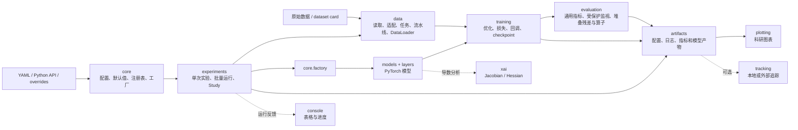
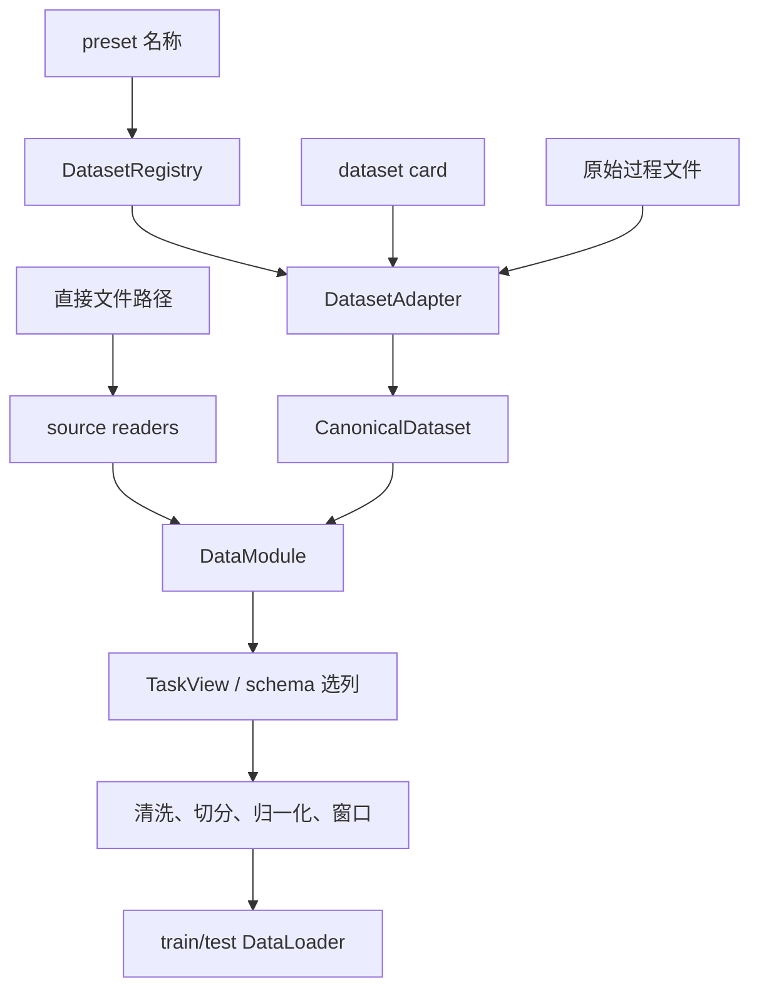
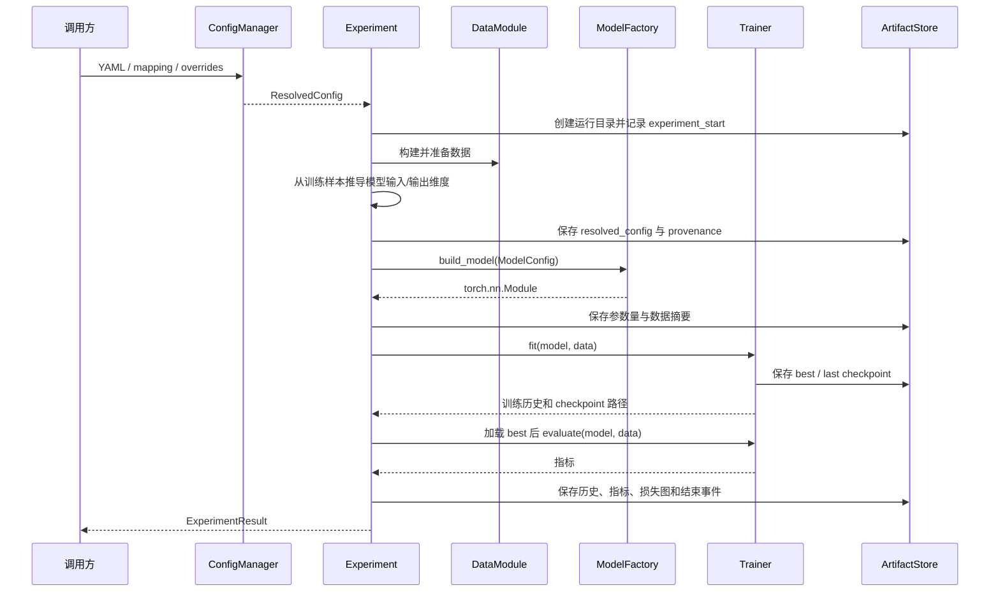

# 技术架构

## 1. 文档目标

本文说明 Joff 核心代码的系统边界、分层职责、主调用链、关键对象、扩展接口、当前限制和架构不变量。文档只讨论 `src/joff` 下的运行时实现；仓库目录、文件数量、核心文件地图和源码阅读顺序单独维护在《[目录结构与文件数](./05-目录结构与文件数.md)》中。

Joff 是一个面向仿真与过程工业数据的 spec-first PyTorch 实验工具包。它把配置解析、数据准备、模型构建、训练、评估、实验编排和科研输出组织为可复现工作流。

## 2. 架构目标

### 2.1 配置先行

实验行为由严格配置描述。用户配置在进入数据或模型代码前先经过默认值合并、Pydantic 校验、字段溯源和哈希计算。未知字段会被拒绝，避免拼写错误静默改变实验。

### 2.2 数据处理边界明确

原始数据先通过 source reader 和 dataset adapter 转为统一数据结构，再由 `DataModule` 选择任务列并执行数据流水线。需要拟合的预处理器应只使用训练数据，防止测试信息泄漏。

### 2.3 模型与运行流程解耦

模型只实现前向计算和模型专属损失。通用优化、epoch 循环、评估和 checkpoint 由训练层负责；单次实验和研究批次由实验层负责。

### 2.4 结果可追溯

每次配置解析都会生成稳定配置哈希并记录字段来源。实验保存解析后配置、数据摘要、参数量、训练历史、指标、图和 checkpoint，使结果能够追溯到配置与运行目录。

### 2.5 导入保持安静

导入 `joff` 不应读取数据、创建运行目录、启动追踪服务或修改 Matplotlib 全局主题。副作用只在显式调用实验、保存或追踪 API 后发生。

## 3. 总体架构



主路径是：

`配置解析 -> 实验编排 -> 数据准备 -> 模型构建 -> 训练 -> 最佳模型恢复 -> 评估 -> 保存产物`

`plotting`、`tracking`、`console` 和 `xai` 是支持模块。它们可以被主路径调用，但不拥有实验业务状态。

## 4. 分层职责

| 层 | 核心模块 | 输入 | 输出 | 责任边界 |
|---|---|---|---|---|
| 基础层 | `core` | YAML、映射、覆盖参数、类型名称 | `ResolvedConfig`、已注册对象 | 配置、默认值、溯源、哈希、设备、随机种子和显式构建 |
| 数据层 | `data` | 文件、数据集卡片、任务与流水线配置 | `CanonicalDataset`、`DataModule`、`DataLoader` | 读取异构数据并形成训练/测试批次 |
| 模型层 | `models`、`layers` | `ModelConfig` 和批数据 | `torch.nn.Module` 输出字典 | 网络结构、前向计算和模型专属损失 |
| 训练层 | `training` | 模型、DataLoader、优化配置 | 历史、指标、checkpoint | epoch/batch 循环、反向传播、评估和恢复 |
| 评估层 | `evaluation` | 预测、标签、重构量、在线记录、潜变量或共同路径 Jacobian/JVP | 结构化报告、监视 trace、堆叠残差和算子包 | 通用指标、受保护参考、名义算子装配与冻结模型后的在线监视状态 |
| 编排层 | `experiments` | 解析后实验或 Study 配置 | 单次结果、批量结果、排行榜 | 协调下层模块并决定运行顺序 |
| 产物层 | `artifacts` | 配置、表格、图、事件 | 运行目录中的持久化文件 | 限制写入边界并提供统一序列化 |
| 展示层 | `plotting`、`console` | 数据、历史、指标 | Figure、表格、终端信息 | 只负责展示，不改变实验语义 |
| 追踪层 | `tracking` | 配置、指标和产物 | 本地或外部追踪记录 | 用统一协议适配不同追踪后端 |
| 分析层 | `xai` | 可微函数/模型和 Tensor | Jacobian、Hessian | 提供模型导数工具，不负责诊断决策 |

## 5. 配置架构

### 5.1 配置对象

`core/config.py` 使用严格 Pydantic 模型定义：

- `ExperimentConfig`：顶层实验配置；
- `DataConfig`：数据源、preset、任务、切分和流水线；
- `ModelConfig`：通用模型类型、维度、网络结构和模型专属参数；
- 模型专用严格配置：注册模型可声明 ``config_model``，例如 P4 的嵌套
  ``ProtectedKoopmanTSConfig``；
- `TrainerConfig`：epoch、优化器、监控指标和最优方向；
- `EvaluationConfig`：评估器类型；
- `ArtifactConfig`：运行产物根目录和运行名称。

所有配置模型继承 `StrictConfig`，默认拒绝额外字段。

### 5.2 配置优先级

`ConfigManager` 与 `ConfigResolver` 按从低到高的顺序合并：

```text
package default
    < model default
    < user config
    < study trial override
    < API kwargs
    < method-call override
    < CLI/environment override
```

后层只覆盖同名叶子字段，其他嵌套字段通过深度合并保留。旧式短参数会先映射为规范 dot-path，例如 `lr` 映射为 `trainer.optimizer.lr`。

### 5.3 配置解析产物

解析结果 `ResolvedConfig` 同时保存：

- 已校验的 `ExperimentConfig`；
- 合并后的原始配置字典；
- 每个叶子字段的来源记录；
- 由规范化配置计算的 16 位 SHA-256 前缀。

实验在根据数据推导 `input_dim` 或 `output_dim` 后，会把推导值记录为 `derived:data_schema`，从而区分用户输入和运行时推导。

## 6. 数据架构

### 6.1 数据进入系统的两条路径



**Preset 路径**用于仓库已知数据集。注册表解析名称，适配器读取专用文件并输出 `CanonicalDataset`。

**直接文件路径**用于通用 CSV、Excel、MAT、NPY 或 NPZ。source reader 先转换为统一表格/数组，再由 `DataModule` 处理。

### 6.2 统一数据对象

- `Segment`：一段表格数据及其分段元数据；
- `CanonicalDataset`：按 split 保存多个 segment，并携带 schema 和来源摘要；
- `DataSchema`：定义列名、角色和采样元数据；
- `TaskSchema`：定义某任务使用哪些输入、目标和标签；
- `TaskView`：根据 schema 从 DataFrame 产生任务数组；
- `DataModule`：最终拥有 PyTorch dataset、DataLoader 和处理摘要。

### 6.3 数据流水线

`DataPipeline` 接受映射、步骤列表或 YAML，并规范化为稳定步骤名。当前支持：

- schema 校验；
- 缺失值处理；
- 异常值处理；
- 数据切分；
- 归一化；
- 插补掩码；
- 动态窗口；
- 序列样本；
- MPC 窗口；
- PyTorch dataset 转换。

流水线配置可以来自数据集默认值、任务默认值和实验显式覆盖。合并后保存摘要，便于检查实际生效的处理步骤。

### 6.4 数据不变量

- schema 和 task 决定输入/目标语义，模型不自行猜测原始列。
- 拟合型清洗和缩放应只从训练 split 学习参数。
- 官方 train/test 数据应保持官方边界。
- 时间序列任务应保留顺序，只有明确允许时才 shuffle。
- `DataModule.save_summaries(...)` 应保存来源、切分和预处理摘要。

## 7. 模型与训练架构

### 7.1 模型注册与构建

内置模型在 `models/__init__.py` 中导出并注册。`build_model(...)` 的处理过程是：

1. 接受任一 ``StrictConfig`` 或映射；

2. 确保内置模型已经延迟注册；

3. 根据 `model.type` 从 `MODEL_REGISTRY` 查找构造器；

4. 若模型声明 ``config_model``，用该专用严格配置解析；否则回退完整 `ModelConfig`；

5. 遇到未知名称时返回带合法选项的构建错误。

显式注册表替代 `eval`/`exec` 和任意动态导入，扩展点更容易审计。

### 7.2 统一模型约定

大多数模型继承 `BaseModel`，遵循以下约定：

- 构造时保存规范化通用或模型专用严格配置；
- `forward(batch)` 返回 Tensor 或包含 `prediction`、`reconstruction`、`latent` 等字段的字典；
- `compute_loss(batch, output, ...)` 返回总损失和可选分项损失；
- `to_config()` 返回可序列化模型配置；
- 兼容 `Trainer` 的 fit/test/load 路径。

`batch_inputs(...)` 与 `batch_targets(...)` 统一处理 Tensor、tuple/list 和字典批数据，避免具体模型重复解析 DataLoader 输出。

### 7.3 Trainer 职责

`Trainer` 负责：

- 解析运行设备并设置随机种子；
- 构建优化器；
- 对训练批执行前向、损失、反向传播和参数更新；
- 对测试/验证 loader 做无梯度评估；
- 汇总总损失和分项指标；
- 调用 callback；
- 保存 last 和按监控指标选择的 best checkpoint；
- 返回结构化训练历史与 checkpoint 路径。

Trainer 不负责读取原始文件，也不决定数据集任务语义。

### 7.4 Checkpoint 内容

`CheckpointManager` 保存：

- 模型类型和参数；
- 优化器状态；
- epoch 与指标；
- 模型配置和完整解析配置；
- Python、NumPy、PyTorch 及可选 CUDA 随机状态；
- 额外运行状态和 UTC 保存时间。

恢复时可以只恢复模型，也可以恢复优化器和其他状态。

## 8. 评估架构

评估器与模型使用相同的注册表/工厂模式。当前主要评估能力为：

| 评估器 | 输入 | 主要输出 |
|---|---|---|
| `RegressionEvaluator` | 真实值、预测值 | MSE、RMSE、MAE、R2、MaxAbs |
| `ReconstructionEvaluator` | 原始值、重构值 | 总体和逐变量重构误差 |
| `ClassificationEvaluator` | 标签、类别或 logits | 准确率和分类汇总 |
| `FaultDetectionEvaluator` | 正常分数、测试分数、二元标签 | 阈值、FAR、MDR、FDR |
| `KoopmanContributionEvaluator` | NKN 前向输出 | 一阶/二阶贡献、比例、稀疏度和维度 |
| P8 动态阈值对象 | estimate 包络、P6/P7 几何、完整 detection-calibration episode | ``gamma_anc``、``gamma_det``、有限秩 ``q_det``、分项阈值和失败关闭状态 |
| P9 结构化隔离对象 | 完整冻结观测、独立 attribution-calibration episode、Normal/fault oracle | 有限秩 ``q_attr``、完整候选集合、物理 singleton 门禁和受控报告 |
| P10 frozen evaluator | 无标签冻结 episode、weights-only checkpoint 和完整正常产物证据 | 逐时刻检测/隔离输出；真实标签只在算法返回后由编排层绑定 |
| P11 次级数据集门禁 | TTS 静态物理协议、CSTR 主提交/配置/正式 manifest 与 completion receipt 身份 | P10 未执行且未通过独立产物复验时，在 TTS 数据与输出 I/O 前拒绝；完成态仍禁止次级结果回写主选择 |

故障检测评估器采用显式 `fit(normal_scores)` 与 `evaluate(test_scores, labels)` 两阶段接口，使正常阈值拟合和测试评价在 API 上分开。

当前 `Experiment.run()` 默认调用 `Trainer.evaluate()` 生成基础训练任务指标；`EvaluationConfig` 尚未自动编排所有独立评估器。论文专用检测和隔离评估需要在实验层增加明确调用，而不能只在配置中填写类型后假定它会执行。

## 9. 实验编排架构

### 9.1 单次实验时序



`ExperimentResult` 返回运行目录、解析配置、溯源、模型、历史、指标、checkpoint 路径和数据摘要，既可供脚本继续处理，也可供 runner/study 聚合。

### 9.2 批量运行

`ExperimentRunner` 接受一组独立实验配置，逐一运行并保存汇总。单个实验失败时，runner 可以记录失败而不丢失已完成结果。

### 9.3 Study

`Study` 在单次实验之上增加：

- grid sweep；
- 随机采样 sweep；
- 多字段 coupled 参数组合；
- 固定列表、偏移或 spawn 随机种子重复；
- 排名指标、最小/最大方向和约束；
- leaderboard、失败统计和最佳结果导出。

Study 只负责展开配置与聚合结果，不应在内部重新定义模型或数据语义。

## 10. 产物与追踪架构

### 10.1 ArtifactStore

`ArtifactStore(root, name)` 创建一个运行目录。所有保存路径必须是相对于该运行目录的安全路径；绝对路径和目录逃逸会被拒绝。

支持保存：

- JSON；
- YAML；
- CSV/表格；
- Matplotlib Figure；
- 由调用方组织的任意子目录结构。

### 10.2 RunLogger

`RunLogger` 以 UTF-8 JSONL 追加结构化事件。单次实验当前至少记录开始、模型构建、评估和结束事件。

### 10.3 Tracker

`Tracker` 协议定义开始运行、记录配置、记录指标、记录产物/图和结束运行。当前实现包括：

- `LocalTracker`；
- `CompositeTracker`；
- 可选 TensorBoard、MLflow 和 W&B 适配器。

外部追踪依赖使用延迟导入。没有安装可选依赖时，导入 Joff 本身仍应成功。

## 11. 扩展接口

| 扩展需求 | 推荐位置 | 必须遵守的接口 |
|---|---|---|
| 新模型 | `models` | 继承/兼容 `BaseModel`，实现 forward 和 compute_loss，并调用 `register_model` |
| 新评估器 | `evaluation` | 返回结构化报告，调用 `register_evaluator`，明确 fit/evaluate 数据边界 |
| 新数据集 | `data.adapters` | 实现 `DatasetAdapter`，输出 `CanonicalDataset` 和 schema/task 元数据 |
| 新源文件格式 | `data.sources` | 读取后输出统一 DataFrame/数组，不混入任务逻辑 |
| 新流水线步骤 | `data.pipeline` | 配置可序列化，明确 fit/transform 阶段，更新流水线规范化入口 |
| 新损失或优化器 | `training` | 保持 Trainer 输入输出约定，不把数据读取放入损失函数 |
| 新研究策略 | `experiments.study` | 只展开配置和聚合结果，复用单次 Experiment |
| 新追踪后端 | `tracking` | 实现 `Tracker` 协议，保持可选依赖延迟导入 |
| 新图表 | `plotting` | 复用 `BasePlotter`、`FigureFactory` 和局部主题 |

## 12. 本论文方法的推荐落点

“受保护 Koopman–T–S 未知故障检测与结构化隔离”不应全部写进一个脚本。按现有边界，推荐拆分为：

| 论文能力 | 推荐模块 | 原因 |
|---|---|---|
| 严格过去编码、T–S 规则和局部 Koopman 动力学 | `layers` + `models/protected_koopman_ts.py`（P4 已实现） | 属于可训练模型结构和前向动力学 |
| 自由多步状态/输出损失 | `training/protected_losses.py` + 模型 `compute_loss`（P4 已实现） | 属于训练目标，需要和模型输出契约一致 |
| 候选起点、受保护参考、冻结与恢复状态机 | `evaluation/protected_reference.py`（P5 已实现） | 属于冻结模型后的在线监测状态，不应污染 Trainer |
| 同锚点堆叠受保护残差 | `evaluation/residuals.py`（P5 已实现） | 显式拒绝跨索引、episode、五阶段或重锚窗口 |
| 堆叠传播、响应算子和联合认证证据 | `evaluation/protected_operators.py`（P6 已实现接口） | exact identity、在线 nominal 数值与 certified enclosure 分账；真实认证后端仍是外部能力 |
| white-space 白化、锚点谱商空间和检测支路库 | `evaluation/postfilter.py`（P7 已实现并完成双轴审查） | estimate-only + ``d+1`` 样本闸门；主对称正定逆平方根；碰撞簇整簇保留；``L_0=Q_w^TW_0``、固定 raw guard/omnibus/matched family 和数值失败 raw-guard replay |
| 输入调度确定性包络和有限 episode 动态阈值 | `evaluation/dynamic_threshold.py`（P8 已实现并完成双轴审查） | estimate 输入/年龄包络与 detection-calibration 分位严格分开；稀疏求解预算、完整时间/mode/branch family、独立 attribution 分区身份、校准对象级真实 stage 绑定、完整 score-map/descriptor/age/半径/P6 算子包证据、source envelope 与 P7 block norm 重放、全部派生量精确重放、certified ``g_nu`` enclosure、有限秩、正 floor、严格超限和 ``+infinity`` 失败关闭 |
| full-normal 归因与集合值隔离 | `evaluation/explanations.py`、`oracle.py`、`structured_isolation.py`（P9 已实现并完成双轴审查） | 完整部署观测和 mask 重算；独立 full-normal episode 校准；完整 family 字典；线性/未认证 outer oracle；物理 singleton 受 certified operator/JVP 门禁 |
| 传感器屏蔽预测 | 模型组件在 `models`，隔离逻辑在 `evaluation` | 训练网络与告警后的诊断决策应分离 |
| Jacobian 和有限时间输入响应空间 | `xai` 提供导数底层，隔离模块负责业务组合 | 避免把故障语义硬编码进通用 Jacobian 工具 |
| 端到端论文实验 | `experiments/paper_development.py`、`paper_freeze.py`、`frozen_cli.py`（P10 软件阶段已完成审查） | development 只读正常数据并从 checkpoint 精确重放；正式入口绑定训练/runtime 权重、evaluator/family 身份和三类认证文件，在 preflight、manifest、一次性 claim、八 episode 故障测试和产物完整性各边界 fail closed |
| 次级数据集安全准备 | `data/adapters/real_process.py`、`experiments/paper_entrypoints.py`、`paper_development.py` | TTS `fe` 变体按静态说明固定七个过程变量、六个受保护答案列、onset 与故障族；P11 runner 只有在真实 P10 manifest、completion receipt、Git 提交、主配置 blob、正常产物 bundle 和完整输出 verifier 全部一致时才可越过阶段门 |
| 论文图表 | `plotting` | 统一尺寸、主题和保存方式 |

该论文尤其需要扩展当前仅有 train/test 的通用路径，显式区分：

`normal train -> normal estimate -> detection calibration -> attribution calibration -> frozen normal test`

真实冻结故障测试是五个正常阶段之外的独立封存范围。

这属于实验和数据协议的核心变化，不能只在测试脚本里临时切数组。

## 13. 当前架构限制

- 通用 `Experiment` 主要覆盖训练和基础测试指标，尚未自动执行任意 `EvaluationConfig`。
- 通用 `DataModule` 的主抽象仍是 train/test；论文五阶段正式边界由
  `data.paper_protocol` 提供，不应回退为临时切数组。
- P4 已提供可学习 Attention--Koopman--T--S 正常模型，P5 已提供受保护在线参考、状态机
  和堆叠残差，P6 已提供名义算子包、联合认证协议和 fail-closed 状态，P7 已提供冻结
  white-space 后滤波候选，P8 已提供 estimate-only 包络、公共支路传播和有限 episode
  detection calibration，并在审查整改后冻结完整坐标族、分区身份和完整 score-map；
  每个分数保留完整半径，半径保留 descriptor/reference age 和权威 P6
  ``OperatorBundle``，校准对象逐分数核验实际 P6 stage，重放时从冻结 estimate 包络与
  同一 P7 branch 复算 source envelope、block norm、anchor、尺度、分数、maxima、分位、
  阈值和严格 alarm，而不只信任哈希或绝对容差；P9 已提供 full-normal attribution
  calibration、集合值隔离和物理 singleton 门禁；仓库仍没有真实
  interval/verified-quadrature 或 full nonlinear 认证 provider。正常验证诊断、
  P5 ``UNVERIFIED`` anchor、
  P6 ``NOMINAL`` 算子或 P7 数值稳定候选都不等于真实数据质量 gate、anchor 正常性、
  确定性认证或故障性能已经通过；P8 的有限 episode 分位也不能扩张成无限期首报警保证。
- 基础 ``FaultDetectionEvaluator`` 仍只提供静态正常阈值和 FAR/MDR/FDR；论文 P8 动态阈值
  与 P9 结构化隔离位于独立公开对象中，不由通用 ``Experiment`` 自动编排。P10 通过
  独立 paper 编排层组合这些对象；当前 development checkpoint 明确不具备正式 P4--P9
  runtime 完整性，正式入口会在 manifest、claim 和 fault value 访问前拒绝。
- P10 的 ``experiments/frozen_evaluation.py`` 当前集中保存 manifest schema、claim、
  workflow、表图来源和 verifier，双轴审查将其标记为结构性体量风险。由于这些对象共同
  承担一次性安全协议，本阶段不做临近提交的高风险拆分；协议稳定后应按 manifest、claim、
  workflow 和 artifact verification 四个职责迁移，并保持现有公开测试不变。
- P11 当前只完成不会访问真实故障值的 TTS 适配与执行前门禁准备。检查点配置仍写
  ``configuration_frozen_fault_evaluation_blocked``；该状态即使 TTS 许可、正常 MAT 和
  输出路径全部就绪也会在数据 I/O 前拒绝。只有真实 P10 formal manifest 同时绑定
  evaluation ID、manifest SHA、自哈希、P2--P9 正常产物 bundle、训练 checkpoint、结构选择
  和 runtime checkpoint，并由运行后 completion receipt 触发独立 verifier 重验一次性 claim、
  artifact index、全部输出 hash 和行数，才能进入后续 TTS normal development；TE 与跨数据集
  共同选择尚未启动。
- tracking 已有协议和实现，但单次 `Experiment` 当前以本地 `ArtifactStore`/`RunLogger` 为主，外部 tracker 不是默认主调用链的一部分。
- `DataModule` 体量较大，集中了多种任务和数据模式；新增论文数据协议时应优先提取明确组件，避免继续把在线诊断逻辑加入该文件。

这些限制是后续扩展边界，不应在论文或项目说明中写成已经完成的能力。

## 14. 架构不变量

后续开发应持续满足：

1. 相同解析配置、数据版本和随机种子应产生可比较运行。

2. 配置未知字段必须失败，不能静默忽略。

3. 数据 schema 和 task 决定列语义，模型不得直接依赖特定原始列名。

4. 拟合型数据处理只能从允许的训练数据学习参数。

5. 模型不创建实验目录，Trainer 不读取原始数据文件。

6. 单次实验负责组合，Study 只负责配置展开和结果聚合。

7. 每个论文结果必须能够追溯到解析配置、数据摘要、checkpoint 和逐次运行产物。

8. 可选追踪和绘图依赖不得让基础包导入失败或产生全局副作用。
