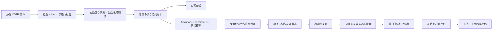

# 论文代码实施计划

状态：**P1-P6 已完成；当前进入 P7 white-space 堆叠残差后滤波**

更新日期：2026-07-29

## 1. 这份计划解决什么问题

当前仓库已经有一个通用的 PyTorch 实验底座 Joff，但还没有实现论文中的完整方法。论文又处于
`Pause / Not theoretically saturated`，意思是三项核心理论经过八轮审查后仍然出现了新的边界问题，
暂时不能把全部公式当成不会变化的最终接口。

因此，正确做法不是把 `paper/main.tex` 从上到下机械翻译成 Python，而是：

1. 先实现不会随理论措辞变化的实验地基；
2. 再建立稳定的数据对象和公开接口；
3. 把尚可能变化的后滤波、阈值和隔离算法放进可替换策略；
4. 未取得外部物理证据或数值认证时，代码明确返回“未认证”并保守拒绝；
5. 每完成一个阶段就测试、审查并提交，使下一阶段永远从一个可运行版本开始。

可以把它理解为“先固定插座的形状，再更换插座后面的电器”。论文以后调整某个公式时，应该只替换
对应策略，不能要求重新切数据、重写训练器或改变所有实验产物。

## 2. 当前真实起点

### 2.1 已经存在、可以复用的能力

| 能力 | 当前实现 | 后续用途 |
|---|---|---|
| 严格配置 | Pydantic 配置拒绝未知字段，保留 provenance 和 16 位 hash | 冻结每次论文实验 |
| 数据适配 | `DatasetRegistry -> DatasetAdapter -> CanonicalDataset` | 接入 CSTR、TTS、TE |
| 时间窗口 | `DynamicWindowDataset` 支持 lookback、future 和 segment 边界 | 构造严格过去和预测窗口 |
| 模型底座 | `BaseModel`、NKN、Attention、DAE、RNN/GRU/LSTM | 基线和新模型组件 |
| 训练 | `Trainer`、优化器、checkpoint、随机状态 | 训练正常模型 |
| 基础故障检测 | `FaultDetectionEvaluator.fit/evaluate` | 静态基线，不是论文动态阈值 |
| 实验与产物 | `Experiment`、`Study`、`ArtifactStore`、`RunLogger` | 复现、汇总和保存结果 |
| 导数工具 | Jacobian、batch Jacobian、Hessian | 验证完整模糊 Jacobian和 JVP |

2026-07-28 的规划基线验证为：

- pytest 共可收集 128 个测试；
- 核心、模型、数据和真实数据迁移四组共运行 82 个测试，其中 76 个通过、6 个因可选依赖跳过；
- `python -m ruff check src tests examples` 通过；
- 全仓库 Ruff 的 30 个问题位于两份 skill 镜像中的 vendored 代码，不属于 Joff 运行时；
- 数据层存在一个 NumPy 只读数组转换为 Torch Tensor 的警告，应记录为技术债，但不阻塞阶段 0。

### 2.2 已确认的关键缺口

1. `CSTRFaultAdapter` 把故障文件的 1201 行全部标成故障；真实 onset 为 200，必须改为逐行标签。
2. CSTR 的 7 列全部是普通 `input`，没有表达
   `u=(Ci,Ti,Tci)` 和 `y=(C,T,Tc,Qc)`。
3. `DataModule` 只有 train/test 主语义，不能表达五段正常数据和独立故障测试。
4. 现有 NKN 和 Attention 都是单步预测器，不是严格过去、自由多步的 Attention--Koopman--T--S 模型。
5. `Experiment.run()` 没有真正编排 `EvaluationConfig`，不能承担论文的训练、估计、两次校准和冻结测试。
6. 尚无受保护参考状态机、堆叠算子、后滤波器、有限 episode 阈值或集合值隔离。
7. certified segment-integral enclosure、full-normal outer oracle 和单调 refinement cache 仍是理论与实现开放项。

## 3. 已确认的实施原则

### 3.1 冻结接口，不冻结理论

稳定对象先定义清楚，例如五段数据、堆叠残差、算子包、监视器状态、支路输出、阈值结果和隔离候选集。
具体算法通过策略接口替换。论文改公式时优先替换策略，不改变数据和实验主流程。

### 3.2 独立论文编排层

不把通用 `DataModule` 和 `Experiment` 强行改成论文专用五阶段流程。新增论文协议对象来组合现有底座：

- 通用层继续服务普通 train/test 实验；
- 论文层显式拥有训练、估计、检测校准、归因校准、正常测试和故障测试；
- 稳定后确认真正通用的能力，再回迁 Joff 核心。

### 3.3 通用接口，CSTR 首验

接口不依赖 CSTR 的具体列名，但第一轮只以闭环 CSTR 为可运行验收对象。CSTR 全链通过后再接 TTS，
最后视时间和计算预算决定是否接 TE。

### 3.4 真实故障数据封存

正式方法冻结前，真实故障文件只用于检查文件、shape、onset 和标签，不能用于：

- 选择模型结构；
- 选择规则数或窗口长度；
- 调后滤波参数；
- 调阈值或告警持续规则；
- 选择拒识条件；
- 根据某个故障效果修改算法。

开发检测和隔离功能时使用正常数据与人工合成的结构性 fixture。这里的 fixture 是“答案完全已知的小型测试数据”，
例如在一条正常序列的第 20 步后给传感器 2 加固定偏差。真实 8 类故障只在协议冻结后运行。

### 3.5 许可不阻塞开发，但阻塞正式结果

CSTR 许可目前是 `to_verify`。本地开发可以继续，但在许可、来源和引用方式确认前：

- 不重新发布原始数据；
- 不把开发运行写成正式论文结果；
- 不执行最终投稿用冻结实验；
- 如许可不适用，保留通用代码并更换主数据集。

### 3.6 直接在 `main` 分阶段提交

项目只有一位主要开发者，不建立功能分支。每个阶段完成测试和代码审查后，在 `main` 上创建独立提交。
不得把多个未验收阶段揉成一次提交。

## 4. 初学者需要先理解的六个词

| 词 | 通俗解释 |
|---|---|
| split（数据段） | 给一部分数据规定唯一用途，例如只能训练或只能校准 |
| calibration（校准） | 模型训练后，用独立正常数据确定阈值；它不是继续训练模型 |
| episode（监视片段） | 一次有固定起点、终点和重置状态的连续监视过程 |
| provenance（来源记录） | 记录某个参数或对象看过哪段数据、由什么配置产生 |
| frozen（冻结） | 参数、规则和状态转移已经确定，后续测试不能再修改 |
| fail closed（保守失败） | 证据不足时拒绝给强结论，而不是猜一个看起来合理的答案 |

## 5. 目标运行结构



主数据流中，真实故障数据只允许从“独立故障测试”进入“冻结 CSTR 评价”，不能反向连接训练、估计或校准。

## 6. 每个阶段都必须执行的工作循环

真正实施时使用 `implement`、`tdd` 和 `code-review` 的规则。每个阶段执行以下循环：

1. 直接以本文对应阶段的接口、测试、产物和停止条件为规格，不再另建阶段 spec 或工单；
2. 根据现有公共 API 选择测试入口，若实现发现接口不成立则先更新本文再继续；
3. 写一个通过公开入口观察行为的失败测试，得到 red；
4. 写最少实现使该测试通过，得到 green；
5. 重复“一个测试 + 一个最小实现”的纵向切片，不一次写完全部测试；
6. 经常运行当前单测试文件、相关测试组和类型检查；
7. 阶段功能完成后运行相关回归测试；
8. 以阶段开始前的提交为 fixed point，分别做规范审查和本文规格审查；
9. 修复审查问题并重新验证；
10. 在 `main` 创建本阶段提交；
11. 下一阶段只从这个已提交的稳定点开始。

## 7. 阶段总览与提交计划

| 阶段 | 核心结果 | 必须通过的闸门 | 计划提交主题 |
|---|---|---|---|
| P0 | 本计划、实验线文档、导航和沟通规则 | 文档一致、无实现冒充 | `docs: freeze paper implementation and experiment plans` |
| P1 | CSTR 物理 schema、逐行标签和 episode 元数据 | onset、u/y、追溯测试 | `data: repair closed-loop CSTR protocol metadata` |
| P2 | 五段正常数据、隔离带和访问账本 | 无原始行/窗口泄漏 | `data: add five-stage normal-only paper splits` |
| P3 | 独立论文编排和正常数据基线 | 不看故障性能也能训练/选择/校准 | `experiments: add paper protocol and normal-only baselines` |
| P4 | 严格过去的 Attention--Koopman--T--S 自由多步模型 | 自由递推、权重、Jacobian、保存恢复 | `models: add protected attention Koopman TS model` |
| P5 | 受保护参考、状态机和统一堆叠残差 | 固定命令下直接路径阻断、确定性重放 | `evaluation: add protected monitor and stacked residuals` |
| P6 | 算子包、名义/认证状态和数值核查 | exact identity 与认证边界不混淆 | `evaluation: add protected operator assembly` |
| P7 | white-space 后滤波、guard 和 matched branches | 同一 `L_b`、tau 平方、盲向守卫 | `evaluation: add stacked residual post-filter` |
| P8 | 输入调度确定性界和有限 episode 校准 | 生命周期、有限秩、正 floor、无穷阈值 | `evaluation: add finite-episode dynamic thresholds` |
| P9 | full-normal 归因和集合值结构化隔离 | 真类不被不安全排除、拒识语义 | `evaluation: add set-valued structured isolation` |
| P10 | 冻结 CSTR 端到端运行、表图生成 | manifest 冻结、一次性故障评价、全套测试 | `experiments: add frozen CSTR evaluation workflow` |
| P11 | TTS/TE 扩展 | 不修改 CSTR 已冻结选择 | `experiments: extend paper protocol to secondary datasets` |

下面逐阶段解释“为什么、做什么、怎样知道完成”。

## 8. P0：规划与规则冻结

### 8.1 目的

先让“要实现什么”和“现在还不能声称什么”进入仓库，避免后续代理把旧四段协议、逐点 FAR 或强制三分类重新写回代码。

### 8.2 本阶段产物

- 本文；
- `docs/07-论文实验线详细说明.md`；
- `docs/01-文档导航.md` 登记；
- `docs/03-当前工作记录.md` 里记录“计划已确认、代码未开始”；
- `AGENTS.md` 的初学者解释规则。

### 8.3 验收

- 所有文档都使用五段正常协议；
- 检测保证写成“预指定有限 episode 的联合最大值”，不是无限期逐点保证；
- 隔离保留 Normal-compatible、Nonunique、Out-of-model 和未认证结果；
- 文档没有实验数值；
- `git diff --check` 通过。

### 8.4 停止条件

如果文档仍混用 FourWayNormalSplitter、故障调参或强制单标签，不能提交 P0。

## 9. P1：修正闭环 CSTR 数据语义

### 9.1 为什么必须最先做

模型和指标只认识适配器输出。如果标签从第 0 行起就写成故障，那么故障开始前的 200 个正常时刻也会被当成故障，
误报率、检测延迟和隔离结果都会错误。若 `u` 和 `y` 不分开，模型也无法知道哪些量是控制指令、哪些量是系统测量。

### 9.2 计划公开能力

候选公开入口：

- `DATASET_REGISTRY.resolve("cstr_closed_loop_fd").read(...)`；
- `CanonicalDataset.schema`；
- `CanonicalDataset.source_summary()`。

P1 已采用上述公开入口完成 TDD 回归。

### 9.3 计划数据语义

| 内容 | 计划表达 |
|---|---|
| 控制输入 | `Ci, Ti, Tci`，role 为 `control_input` |
| 测量输出 | `C, T, Tc, Qc`，role 为 `measured_output` |
| 当前有效故障标签 | onset 前 `fault_id=0`，onset 后为 1--8 |
| episode | `normal` 或 `fault01`--`fault08` |
| 原始位置 | 显式 `time` 与 `raw_index`，预处理后仍可追溯 |
| 场景元数据 | `episode_fault_id`、`fault_family`、`fault_onset` 放在 segment metadata，不喂给模型 |
| 故障族 | 1--2 process、3--5 actuator、6--8 sensor |

onset 的边界必须由权威数据说明确认。当前计划按“时间值小于 200 为正常，时间值大于等于 200 为故障”准备测试，
但在 P1 写测试前必须再次核对原始说明，不能只凭数组下标猜测。

### 9.4 实施任务

1. 新增 CSTR 专用协议回归测试；
2. 修改 `src/joff/data/adapters/real_process.py` 的 CSTR 分段逻辑；
3. 更新 `datasets/cards/oa/cstr_closed_loop_fd/dataset_card.yaml`；
4. 确保 task 选择历史输入时可以显式组合 control input 与 measured output；
5. 在 source summary 保存变量名、episode、onset 和数据哈希；
6. 保证窗口不跨 episode；
7. 保持其他真实过程数据适配器行为不变。

### 9.5 关键测试

- normal 16814 行全部为正常；
- 每个 fault episode 1201 行，onset 前后标签分别正确；
- 3 个控制输入和 4 个测量输出精确对应；
- 模型输入不包含 `fault_family`、`fault_onset` 等答案信息；
- 任意一条预测或告警可以反查原始 episode 和时间；
- 旧 preset 名称和短别名仍可解析。

### 9.6 阶段产物

- CSTR schema JSON/YAML；
- episode 摘要；
- 每个 episode 的标签计数；
- 原始文件 hash；
- P1 测试报告。

### 9.7 停止条件

- 找不到 onset=200 的权威来源；
- 7 个变量的物理顺序与当前审计不一致；
- 许可信息表明数据不能用于本地研究。

发生前两种情况时必须暂停并向用户或导师报告，不能自行猜列名或故障边界。

## 10. P2：五段正常数据与隔离带

### 10.1 五段到底是什么

五段都来自正常长序列，每段只有一个用途：

| 阶段 | 只允许做什么 | 禁止做什么 |
|---|---|---|
| `train` | 学习神经网络、局部矩阵和模型参数 | 调最终阈值 |
| `estimate` | 选结构、拟合 scaler、包络、协方差、支路和状态机 | 计算最终检测/归因分位 |
| `detection_calibration` | 只计算检测 episode maximum 的分位数 | 改模型、支路或状态机 |
| `attribution_calibration` | 在检测分位冻结后，只计算 full-normal 归因分位 | 重算检测分位或改 mask |
| `frozen_normal_test` | 最终检查正常误报和运行稳定性 | 反向调任何设计 |

真实 `frozen_fault_test` 是五段之外的独立第六个访问范围，不是正常数据的第五段。

### 10.2 为什么需要隔离带

一个训练样本不只读取一个时刻。例如 lookback=3、future=2 的样本会同时读取 5 行。若直接在样本编号上切段，
边界附近的训练样本可能读取校准段的未来行，造成数据泄漏。

实现必须：

1. 先在原始时间轴上分段；
2. 在段与段之间移除隔离带；
3. 计算每个窗口实际依赖的全部原始行；
4. 只有全部依赖行落在同一段，窗口才属于该段。

论文当前给出的隔离带下限是 `ell_h + N_max`。实现还要根据真实 lookback、rollout、堆叠窗和 mask 重算依赖跨度，
使用更保守的最大值，不能只抄一个常数。

### 10.3 计划对象

- `StageName`：受控枚举，禁止自由字符串拼写；
- `FiveStageSplitConfig`：比例、隔离带、episode 长度和随机策略；
- `StageSlice`：原始行范围、可用窗口和哈希；
- `FiveStageSplitResult`：五个正常段；
- `PaperDataBundle`：五段正常数据加独立故障测试；
- `FitAccessLedger`：记录每个拟合对象看过哪些数据段。

建议新模块为 `src/joff/data/paper_protocol.py`，避免继续扩大已经较大的 `datamodule.py`。

### 10.4 关键测试

- 55/15/10/10/10 的比例在扣除隔离带后按规范计算并记录；
- 五段原始行两两不重叠；
- 五段窗口依赖行两两不重叠；
- 修改校准或故障数据不能改变训练 scaler、模型输入或训练 hash；
- detection 和 attribution calibration episode 不复用；
- 相同数据、配置和种子得到相同 split manifest；
- 请求不存在的阶段时给出包含合法选项的错误；
- 在协议冻结前请求真实故障性能时被拒绝。

### 10.5 产物

- `split_manifest.json`；
- 每段原始索引和窗口索引；
- 隔离带说明；
- 数据文件与准备后数据 hash；
- fit access ledger。

### 10.6 停止条件

正常长序列扣除隔离带后不足以形成五个非空阶段，或者 calibration episode 数量不足以支持目标风险水平时，
必须重新讨论 episode 长度、风险水平或数据集，不能偷偷缩短隔离带。

## 11. P3：论文协议与最小正常数据基线

### 11.1 为什么先做简单基线

基线不是为了“赢”，而是检查数据、分数、阈值和指标是否形成合法闭环。如果 PCA 都不能按五段协议运行，
直接调复杂 Koopman 模型只会把基础错误藏在神经网络里。

### 11.2 独立论文编排

建议新增 `src/joff/experiments/paper_protocol.py`，负责按固定顺序调用：

```text
训练模型(train)
-> 冻结模型
-> 估计设计量(estimate)
-> 冻结检测 score/state map
-> 检测校准(detection_calibration)
-> 冻结 q_det
-> 归因校准(attribution_calibration)
-> 冻结 q_attr
-> 正常测试(frozen_normal_test)
-> 协议冻结后故障测试(frozen_fault_test)
```

通用 `Experiment.run()` 暂时保持原行为。论文协议组合 `Trainer`、checkpoint 和 `ArtifactStore`，但不把五段伪装成
普通 train/test。

### 11.3 最小基线

1. PCA 的 Hotelling `T^2` 和 SPE/Q；
2. DAE 重构误差；
3. 一步 MLP 或 GRU 动态预测误差；
4. 当前 NKN/Koopman 一步预测残差；
5. 论文相关的 measurement-driven Koopman parity 基线在其定义和公平调参范围核实后加入。

所有基线遵守同一数据段、同一正常数据预算和同一冻结测试边界。

### 11.4 关键测试

- 不提供故障数据也能完成 train、estimate 和两次 calibration；
- 每个拟合对象的 access ledger 只含允许阶段；
- 同一基线可以输出逐时刻 score、threshold、alarm 和原始索引；
- 静态分位基线不能被标记为论文动态阈值；
- 协议冻结前无法运行正式故障指标；
- checkpoint 恢复后分数一致；
- CPU smoke 在小数据上完成。

### 11.5 阶段验收

至少三种简单基线从配置运行到正常校准并保存完整产物。此时只证明实验流水线可用，不证明论文方法优于基线。

## 12. P4：严格过去的 Attention--Koopman--T--S 模型

### 12.1 这一阶段只解决正常建模

本阶段不实现告警和隔离。它回答：

- 严格过去能否编码当前正常状态；
- 单一 Koopman 能否自由多步预测；
- 加入 T--S 规则后能否覆盖不同运行区域；
- 训练和在线是否使用完全相同的自由 rollout。

### 12.2 计划模块

| 模块 | 责任 |
|---|---|
| `models/protected_koopman_ts.py` | 公开模型、forward、rollout 和输出契约 |
| `layers/causal_attention.py` | 严格过去 token、causal mask、channel mask |
| `layers/fuzzy_koopman.py` | premise、softmax 权重、局部 `A_i/B_i/o_i` |
| `training/protected_losses.py` | 自由多视野、解码一致性、方差、规则平衡和 Jacobian 产品损失 |

实际文件拆分在 P4 规格阶段根据代码体量确认，但公开模型不能把实验目录或在线状态机放进自身。

### 12.3 模型必须满足的行为

- 历史只含 `k` 之前的 `u/y`；当前 `y_k` 不进入 `z_k^E`；
- 每个规则权重非负，所有规则权重和为 1；
- 一条规则时退化为单一 Koopman；
- 第二步以后自由递推只读取预测输出，不读取真实未来输出；
- forward/rollout 返回预测、潜变量、context、规则权重、局部/组合算子和完整轨迹；
- 相同输入与状态在保存、加载前后输出一致；
- 所有使用的映射可微；
- channel mask 训练分布在配置中明确并可复现。

### 12.4 Jacobian 验证

完整 Jacobian 必须包含“规则权重随状态变化”的项。测试同时比较：

1. 解析实现；
2. PyTorch autograd；
3. 中心有限差分的小型数值例子。

只使用加权平均 `sum(omega_i A_i)` 而忽略 membership variation 的实现不能通过。

### 12.5 停止条件

- 自由多步误差随视野立即爆炸；
- 规则长期只使用一个分支且无法通过正常数据调整；
- latent collapse，所有样本潜变量几乎相同；
- 解析 Jacobian 与 autograd 不一致。

出现这些问题时先缩短视野、减少规则或回退单一 Koopman，不能直接进入受保护参考。

## 13. P5：受保护参考、监视器状态和堆叠残差

### 13.1 直觉

数据支路继续读取真实历史，用来描述系统现在发生了什么；受保护支路从一个候选锚点开始自由预测，
锚点后的 measurement slot 只能放预测输出，不能放真实测量。

### 13.2 计划对象

- `MonitorState`：锚点、年龄、候选、hysteresis、mode、buffer 和 reset 状态；
- `ProtectedRollout`：受保护潜变量、预测输出和 context；
- `StackedProtectedResidual`：窗口、原始索引、锚点和残差；
- `AnchorGateConfig`：估计段冻结的门和延迟；
- `ProtectedMonitor.step(state, record)`：纯状态转移；
- `MonitorTrace`：每一步状态、输入和输出的可追溯日志。

建议模块为 `src/joff/evaluation/protected_reference.py` 和
`src/joff/evaluation/residuals.py`。

### 13.3 关键测试

- 固定记录命令时，改变锚点后真实测量不会改变 protected rollout；
- 允许控制器命令随测量改变时，总路径可以改变，测试不得错误宣称因果独立；
- final detection quantile 改变时，生成校准分数的 anchor/mode 轨迹不变；
- reset 后相同 episode 得到相同 trace；
- 窗口不跨 episode 或五段边界；
- 受保护 buffer 不含 post-anchor 真实 measurement token；
- 状态和 trace 可序列化并带 hash。

### 13.4 重要边界

“一段时间没有报警”不能证明旧锚点一定正常。代码必须携带 `anchor_coverage_status`，不允许把延迟确认自动写成
`clean=True`。

## 14. P6：堆叠算子装配与认证状态

### 14.1 为什么单独成阶段

论文中的 exact segment integral 是解析恒等式，但在线计算一个 JVP 并不自动得到认证外包。若把两者混成一个函数，
后续代码很容易把名义数值当成安全证书。

### 14.2 计划对象

- `OperatorBundle`：`G_nu`、`G_0`、输入响应、传感器 JVP、过程先验和公共路径信息；
- `OperatorStatus`：`nominal`、`certified`、`unavailable`；
- `OperatorAssemblyBudget`：在任何稠密分配前限制 workspace 和持久化标量元素；
- `NominalJVPAssembler`：在显式资源预算内提供可测试的名义算子；
- `CertifiedEnclosureProvider`：认证后端协议；
- `OperatorEnclosure`：全部命名算子的中心、共享仿射生成元、误差半径、范数和来源。

无认证后端时，名义算子仍可用于数值诊断和消融，但所有“安全排除”调用必须得到
`certified=False`，不能伪造一个很小的 epsilon。

P6 已按该边界实现。认证 provider 不能返回若干彼此独立、只复制同一字符串标签的误差球；
它必须返回一个联合 enclosure，所有命名算子使用同一组不确定系数。``require_certified()``
只返回这个整体对象，多个算子的线性最坏情形通过一次联合 support 计算。仓库当前没有真实
interval/verified-quadrature provider，因此该接口完成不等于确定性认证已经可用。

### 14.3 关键测试

- 手算的二维线性系统能精确恢复块下三角 `G_nu`；
- `G_nu` 对角块是单位矩阵并可逆；
- exact stacked propagation 在数值精度内成立；
- 同一个 operator-error 元素在所有支路共享，不能每条物理路径独立挑最有利误差；
- 未认证 provider 不能产生 certified isolation singleton；
- 认证状态贯穿 artifact 和最终报告。

## 15. P7：white-space 堆叠残差后滤波

### 15.1 三步结构

1. 用估计段的堆叠协方差做跨时间白化；
2. 在 white space 对锚点影响做谱选择；
3. 建立 omnibus、未零化 guard 和 matched branches。

### 15.2 必须保持的公式关系

- `L_0 = Q_w^T W_0`；
- matched branch 使用 `L_c = P_c L_0`；
- guard 使用原残差坐标的恒等算子；
- 奇异值阈值 `tau` 在 Gram 矩阵上必须比较 `tau^2`；
- 重复奇异值簇整簇保留或整簇移除；
- 谱阈值碰撞进入显式 hybrid mode；
- 每条支路的统计、锚点半径、确定性半径和 signature 使用同一个 `L_b`。

### 15.3 计划模块

- `evaluation/postfilter.py`；
- `PostFilterCandidate`；
- `BranchOperator`；
- `BranchBank`；
- `SpectralMode`；
- `WhiteningEstimate`。

### 15.4 关键测试

- 已知矩阵例子验证 `tau` 与 `tau^2`；
- white-space 选择不能错误投影到 raw space；
- 被 quotient 去掉的故障方向仍被 guard 看见；
- 部分 annihilation 后锚点半径不为零并进入阈值；
- zero-scale branch 被禁用或使用预先冻结的正 floor；
- 支路只在 estimate 段选择；
- 加入支路后必须重新校准，不宣称功效必然不差。

### 15.5 停止条件

估计段样本不足导致协方差或谱簇不稳定时，减少支路或回退 guard-only/omnibus，不能用最终 calibration 数据反复挑支路。

## 16. P8：输入调度的有限 episode 动态阈值

### 16.1 阈值的三个部分

| 部分 | 通俗含义 | 数据来源 |
|---|---|---|
| `gamma_anc` | 受保护锚点本身可能不准 | estimate |
| `gamma_det` | 输入大小、输入变化、运行区域和 reference age 带来的正常误差 | estimate |
| `sigma*q_det` | 前两项未覆盖的随机剩余 | detection calibration |

最终还要取一个提前冻结的正数 floor，保证分母不会是零。

### 16.2 计划模块

- `InputDependentEnvelope`；
- `ContextAgeEnvelope`；
- `DeterministicRadiusGenerator`；
- `EpisodeMaxCalibrator`；
- `DynamicThresholdGenerator`；
- `ThresholdResult`，包含每一项分账和认证状态。

建议模块为 `src/joff/evaluation/dynamic_threshold.py`。

### 16.3 有限样本分辨率

如果 calibration 有 `n` 个独立 episode，能得到有限分位数的最小风险水平是 `1/(n+1)`。

例如只有 19 个 calibration episode 时，最小可实现水平是 1/20=0.05。此时请求 0.01 不能假装计算出可靠阈值，
代码必须返回 `+infinity` 并禁用该决定。这也是为什么当前基础评估器默认的 0.005 不能直接搬到论文有限 episode 校准。

### 16.4 关键测试

- envelope 的 `u`、`delta_u` 和状态输入真实改变 deterministic radius；
- score/state map 在 calibration 前冻结；
- final quantile 不反馈生成自身 score 的状态轨迹；
- episode maximum 包含所有可选择时间、mode 和检测支路；
- 检测与归因 calibration episode 完全独立；
- 请求低于有限样本分辨率时阈值为正无穷；
- strict exceedance 和 tie 规则正确；
- threshold 每部分单独记录；
- 不把有限 episode 结论写成无限首报警保证。

### 16.5 停止条件

- episode 定义或 reset state 未冻结；
- calibration episode 数不足；
- mode/anchor 依赖最终 quantile；
- 确定性包络用到了真实故障性能。

任一条件成立都不能进入冻结评价。

## 17. P9：full-normal 归因与集合值结构化隔离

### 17.1 为什么不能总是输出一个类别

同一段输入输出记录可能同时被“执行器异常”或“过程扰动”解释。仅正常数据也不能自动告诉代码真实过程故障怎样注入。
证据不足时强制输出一个类别，会把不可辨识问题伪装成高准确率分类。

### 17.2 输出语义

- 非正常 singleton：只有一个非正常解释可行；
- `Normal-compatible`：报警了，但完整正常解释仍然可行；
- `Nonunique`：多个解释都可行；
- `Out-of-model`：声明的任何解释都不覆盖；
- equivalence class：只能说 learned-input-side 或 process-side 等较弱类别；
- `Uncertified`：缺少 signature、nuisance 或 operator 认证。

### 17.3 计划对象

- `DeployedObservation`：完整 monitor state、raw window、`L/T/Gamma`、operator enclosure 和 mask 输出；
- `ExplanationFamily`；
- `OuterExplanationOracle`；
- `MonotoneRefinementCache`；
- `FullNormalCalibrator`；
- `IsolationCandidateSet`；
- `IsolationReport`。

建议模块：

- `evaluation/explanations.py`；
- `evaluation/structured_isolation.py`；
- `evaluation/oracle.py`。

### 17.4 两阶段校准顺序

1. detection calibration 冻结 `q_det`；
2. 在独立 attribution calibration episode 上重放完整 mask/oracle 流程；
3. 计算 full-normal episode maximum；
4. 冻结 `q_attr`；
5. 若 attribution 样本分辨率不足，normal 永远不能被排除，非正常 singleton 禁用。

### 17.5 外部物理证据

- 执行器物理标签需要正常输入具有足够激励；
- 传感器横向 JVP 需要外部扰动覆盖、控制器响应或结构约束；
- 过程标签需要外部 process injection map；
- 缺少这些证据时，只输出较弱等价类。

### 17.6 关键测试

- 真解释在声明的 signature/nuisance coverage 事件内不会被排除；
- 未决 oracle cell 必须保留竞争解释；
- 扩大半径不能让 outer family 变小；
- monotone cache 保持嵌套和右闭语义；
- mask 是完整流水线反事实重算，不是直接删 residual 一列；
- mask 未能 exonerate 不能自动排除传感器解释；
- normal attribution 读取完整 observation；
- 没有 certified operator 时不允许物理 singleton；
- mixed 支持遵守“最多一个传感器 + 一个 dynamics-side”的并发先验；
- 输出风险不能误写成 PPV、FDR 或后验置信度。

### 17.7 理论未闭合时的实施边界

P9 可以先完成安全的接口、线性特例、集合输出和未认证路径。full nonlinear outer oracle 只有在规格、认证后端和物理先验
明确后才能标记完成。阶段计划允许“功能实现完成但 certification gate 未通过”，不能把二者写成同一个布尔值。

## 18. P10：冻结 CSTR 端到端评价

### 18.1 冻结前必须具备的 manifest

`FrozenProtocolManifest` 至少记录：

- Git commit；
- resolved config 与 config hash；
- Python、PyTorch 和关键依赖版本；
- 原始数据文件 hash；
- 五段 split 和 episode manifest；
- 所有随机种子；
- checkpoint hash；
- fit access ledger；
- 后滤波 candidate、mode 和 branch library；
- anchor gate、hysteresis 和 reset state；
- `q_det`、`q_attr`、样本数和可实现风险分辨率；
- operator/signature/nuisance certification 状态；
- 一次性 frozen evaluation ID。

### 18.2 运行入口

计划新增：

- `configs/paper/smoke.yaml`：合成数据 CPU 冒烟；
- `configs/paper/cstr_development.yaml`：正常数据开发；
- `configs/paper/cstr_frozen.yaml`：冻结协议；
- `examples/paper_smoke.py`：最小端到端路径；
- 一个明确的 frozen evaluation 命令。

这些路径和命令当前尚不存在。实施完成前，文档不得把它们写成已经可运行。

### 18.3 真实故障运行规则

1. frozen manifest 写入并设为只读逻辑状态；
2. 执行一次 8 个真实 fault episode；
3. 保存所有逐时刻输出；
4. 生成主表/主图所需机器可读数据；
5. 不根据结果修改同一 manifest；
6. 如需修改方法，创建新的协议版本和新的 frozen evaluation ID。

### 18.4 最终验证

- 全套 pytest；
- Ruff；
- 项目采用的类型检查；
- CPU smoke；
- checkpoint 重放一致；
- artifact 完整性；
- 规格与规范双轴代码审查；
- 不包含原始 private 数据或生成产物；
- Git 提交后工作树只剩用户明确保留的无关修改。

## 19. P11：TTS 与 TE 扩展

只有 P10 的 CSTR 流程完成后才开始：

1. TTS 作为第二个非线性过程；
2. TE 作为高维复杂过程的可选扩展；
3. 不允许根据 TTS/TE 结果回头修改已声称冻结的 CSTR 选择；
4. 若需要跨数据集共同选择结构，必须在运行任何 frozen fault test 前写入新的多数据集协议。

## 20. 论文要求与代码模块对照

| 论文要求 | 代码责任 | 主要阶段 |
|---|---|---|
| 五段正常协议 | `data.paper_protocol` | P2 |
| 严格过去编码 | causal attention layer | P4 |
| T--S 局部 Koopman | fuzzy Koopman layer/model | P4 |
| 自由多步训练 | protected losses/model rollout | P4 |
| 受保护双支路 | protected monitor | P5 |
| exact stacked residual | residual/operator bundle | P5--P6 |
| white-space quotient + guard | post-filter | P7 |
| 输入/路径动态阈值 | deterministic radius + calibrator | P8 |
| finite episode false alarm | episode maximum calibrator | P8 |
| full-normal attribution | full-normal calibrator | P9 |
| 三类 explanation graph | structured isolation/oracle | P9 |
| 冻结正式实验 | paper protocol + manifest | P10 |

## 21. 配置设计原则

现有 `ModelConfig` 和 `EvaluationConfig` 不足以安全表达全部论文对象。后续配置应：

- 每个配置都严格拒绝未知字段；
- 避免把几十个论文参数无类型地塞进一个 `dict`；
- 将模型、monitor、post-filter、threshold、isolation 和 protocol 分成嵌套严格配置；
- 每个风险水平、窗口、gap 和 episode 长度写明单位；
- 明确 `development` 与 `frozen` 模式；
- 配置 hash 包含所有会改变分数或状态路径的字段；
- 所有默认值都能解释来源，理论敏感参数不设“看起来合理”的隐藏默认。

## 22. 产物与追溯要求

每次开发或正式运行至少保存：

- resolved config 和 provenance；
- Git commit；
- 数据、split、窗口和 episode hash；
- fit access ledger；
- checkpoint 和训练历史；
- 一步/多步预测及规则权重；
- protected state trace；
- 堆叠残差和 operator status；
- 每条支路的 `L_b`、统计量和阈值分账；
- anchor、mode、guard-only、infinite-threshold 和 suppressed-alarm 日志；
- mask 重算和候选解释集；
- 逐时刻标签、候选集和拒识原因；
- 汇总表和图的机器可读来源。

主表和主图只能从这些产物自动生成，不能从终端手工抄数字。

## 23. 变更控制

论文未定稿时，每次理论变化先分成三类：

1. **只改文字**：不影响代码；
2. **改策略**：替换 post-filter/threshold/oracle 策略，稳定对象不变；
3. **改信息边界或数据协议**：可能影响全链，必须做 impact review 并创建新协议版本。

任何变化若会改变校准 score/state path，旧 calibration 和 frozen test 立即失效，必须重新冻结。

## 24. 阶段完成的统一定义

一个阶段只有同时满足下列条件才算完成：

- 本文中的阶段要求已逐项映射到实现和验收证据；
- 公开测试入口能够覆盖核心行为；
- TDD 测试覆盖核心行为；
- 相关单测和回归测试通过；
- 类型和 lint 检查通过；
- CPU smoke 可运行；
- 配置、产物和错误信息可理解；
- 中文 docstring/注释与行为一致；
- 未认证边界没有被隐藏；
- 代码审查无未解决高优先级问题；
- 已在 `main` 创建独立 Git 提交。

“代码能跑”只满足其中一项，不能单独视为完成。

## 25. 当前实施入口

P1 已完成物理 schema、逐行标签、episode/source hash 与 DataModule sequence 边界修正。
P2 已完成 FiveStageNormalSplitter、隔离带、窗口依赖、完整 calibration episode、
FitAccessLedger、manifest 和冻结故障门禁。P3 已完成独立论文协议、PCA/DAE/一步 MLP
正常基线、静态 episode 校准、checkpoint 重放及可追溯产物。

P4 已完成有序严格过去 causal attention、当前外生工况编码、可复现 channel mask、训练
视野均匀抽样、可学习 T--S 局部 Koopman、自由多步 rollout、分项损失和 fail-closed
正常验证诊断；完整 ``J_z/J_u/J_context/J_xi`` 均通过解析式、autograd 和中心有限差分
三方验证。

P5 已完成严格分离的 data/protected 双支路与同边界同锚点堆叠残差。P6 已完成受显式
资源预算约束的 ``OperatorBundle`` 名义装配、``G_nu/G_0``、输入/过程/传感器响应、三态
认证边界、共享仿射 operator-error 元素和 JSON 产物重放；真实认证 provider 仍然缺失，
因此 nominal/unavailable 路径不能授权安全排除。当前实施入口是第 15 节 P7：

1. 仅用 normal estimate episode 拟合堆叠协方差和 white-space 变换；
2. 在 white space 对 anchor image 做谱选择，不能按列索引直接删除坐标；
3. 同时保留 omnibus、未零化 guard 和 matched branches；
4. 所有 candidate、rank、condition number 和回退原因进入可追溯产物；
5. 通过 P7 相关验证和双轴审查后形成独立提交，再进入 P8。
