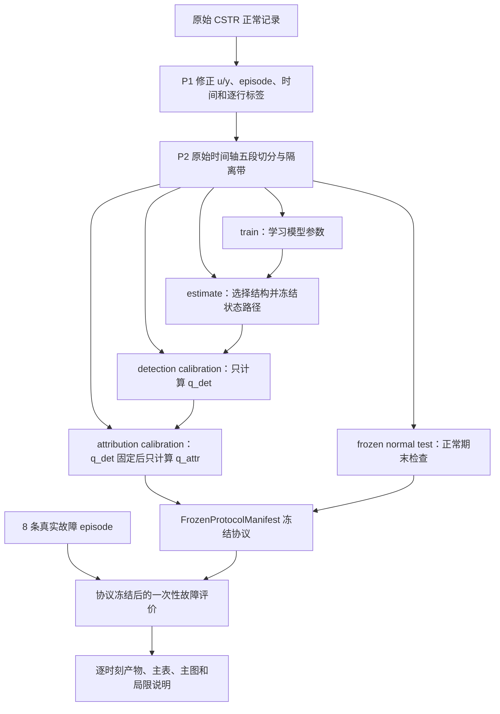

# 论文实验线详细说明

## 1. 先说结论：这条实验线到底要做什么

这篇论文的实验不是“把一个模型训练好，然后看故障分类准确率”这么简单。它要建立并验证一条严格的证据链：

1. 只用正常数据学习“系统正常时应该怎样变化”；
2. 只用另外的正常数据设计监视器、后滤波器和动态阈值；
3. 再用两批互不重复的正常数据，分别校准“检测误报风险”和“归因误报风险”；
4. 把模型、状态机、阈值、代码版本和评价规则全部冻结；
5. 最后才允许读取真实故障结果，回答“能否及时检测”和“证据是否足以隔离故障”。

这里最重要的不是让某个数字尽量高，而是保证每个数字都来自合法的数据流程，能追溯、能复现，并且没有偷看故障答案。

当前状态仍是**规划阶段**。本文描述的是后续要执行的实验流程，不代表论文方法已经实现，也不代表任何正式实验已经完成。

## 2. 本文和其他文档是什么关系

三个文档分工不同：

| 文档 | 主要作用 | 阅读方式 |
|---|---|---|
| [论文研究完整路线](./02-论文研究完整路线.md) | 说明整个研究怎样从学习、文献、实验推进到投稿 | 看研究全局和先后顺序 |
| [论文代码实施计划](./06-论文代码实施计划.md) | 说明 P0-P11 每阶段要新增哪些接口、测试和代码 | 真正开始写代码前查具体实施要求 |
| 本文 | 单独把“实验线”用初学者能跟上的方式串起来 | 看数据怎样流动、结果怎样产生和怎样验收 |

《论文研究完整路线》形成较早，其中部分实验细节已经被后续八轮理论审核更新。遇到冲突时，按下面的优先级判断：

1. `paper/main.tex` 的当前方法与实验协议；
2. `MANUSCRIPT_CONTEXT.md` 的研究边界和未决状态；
3. 《论文代码实施计划》的阶段接口与测试要求；
4. 《论文研究完整路线》的总体推进顺序。

### 2.1 必须纠正的三处旧规格

| 旧表述 | 当前正确规格 | 为什么改变 |
|---|---|---|
| 四份数据或 `FourWayNormalSplitter` | 五个互不重叠的正常数据阶段，外加独立故障测试 | 检测校准和归因校准不能复用同一批正常 episode |
| 逐时刻 FAR 作为主要保证 | 预先规定的有限 episode 内，所有可选时刻、模式和检测支路的联合最大值校准 | 单个时刻误报率不能自动保证整段运行不误报 |
| 每次必须输出一个故障类别 | 输出候选集合，并允许 `Normal-compatible`、`Nonunique`、`Out-of-model` 和未认证结果 | 数据可能无法唯一支持某个物理类别，强制分类会制造虚假确定性 |

后续实现不得把这三项旧规格重新写回代码。

## 3. 初学者先理解八个词

### 3.1 正常数据

没有已知故障的系统运行记录。论文允许用正常数据训练模型、选择结构、估计正常误差和校准阈值。

“正常”不等于“每个数值都相同”。系统负荷、控制指令、温度和浓度仍然会正常变化。模型要学习的正是这种允许的变化。

### 3.2 故障 episode

`episode` 可以理解为“一次有明确开始和结束的连续运行片段”。例如 `fault03` 的 1201 行数据是一条故障 episode。

论文的误报保证也按有限正常 episode 计算，而不是把无限运行时间当作一次实验。

### 3.3 基线

基线是用来比较的已有或较简单方法，例如 PCA、重构自编码器和一步预测器。基线的作用不只是“让新方法赢”，更重要的是检查数据、阈值和指标流水线是否正确。

### 3.4 消融

消融是从完整方法中去掉一个部件，再观察结果怎样变化。例如去掉反事实传感器屏蔽后，隔离结果变差，才能说明这个部件提供了独立作用。

### 3.5 校准

校准不是继续训练模型。校准是在模型和规则已经固定后，用未参与训练的正常数据确定分位数或风险阈值。

### 3.6 冻结

冻结表示某个对象已经固定，后续查看故障结果时不能再修改。被冻结的对象包括模型参数、数据切分、状态机、阈值规则、随机种子和指标定义。

### 3.7 数据泄漏

数据泄漏是本来不该被某一步看到的信息，提前进入了训练、选择或校准。例如看完 `fault06` 检测很差后再调窗口长度，就是把最终测试信息泄漏回了设计过程。

### 3.8 认证与未认证

“数值上算出一个结果”不等于“理论上有安全保证”。认证表示代码使用了满足声明条件的外包、误差界和物理先验；缺少这些证据时，程序可以输出数值诊断，但必须标记为未认证，不能安全地排除其他解释。

## 4. 用 CSTR 例子理解实验对象

主实验计划先使用闭环连续搅拌釜反应器，即 CSTR 数据集。`cstr_closed_loop_fd` 当前审计得到：

| 内容 | 当前已知信息 |
|---|---|
| 正常记录 | 16814 行，7 个变量 |
| 故障记录 | `fault01` 至 `fault08`，每条 1201 行 |
| 控制输入 `u` | `Ci, Ti, Tci`，共 3 个 |
| 测量输出 `y` | `C, T, Tc, Qc`，共 4 个 |
| 故障开始 | 当前资料指向时间值 `onset=200`，P1 写测试前仍要核对权威说明 |
| 过程故障 | 1-2 |
| 执行器故障 | 3-5 |
| 传感器故障 | 6-8 |
| 许可 | `to_verify`，不阻塞本地开发，但阻塞正式冻结结果 |

一个最直观的错误是：当前适配器把每条故障文件从第一行开始都标成故障。若真实故障从时间 200 才开始，那么前面的正常部分也会被算成故障，检测延迟、漏检率和误报分析都会错。

因此，实验线的第一项代码工作不是复杂神经网络，而是把列角色、episode、原始时间和逐行标签修正确。

## 5. 五阶段正常数据协议

### 5.1 五段各自做什么

一条正常长序列计划按论文当前规格切成 `55/15/10/10/10%` 的五个阶段。实际行数还要扣除段间隔离带。

| 阶段 | 通俗解释 | 允许的工作 | 绝对禁止 |
|---|---|---|---|
| `train` | 上课学习 | 学神经网络、局部矩阵和其他可学习参数 | 看最终阈值或故障效果 |
| `estimate` | 设计实验工具 | 选结构，拟合 scaler、协方差、包络、支路、状态机和 oracle 层级 | 计算最终检测或归因分位数 |
| `detection_calibration` | 单独定检测尺子 | 只计算检测 episode maximum 的分位数 `q_det` | 改模型、支路、状态机或数据切分 |
| `attribution_calibration` | 单独定归因尺子 | 在 `q_det` 冻结后，只计算 full-normal 归因分位数 `q_attr` | 重用检测校准 episode 或修改 mask/oracle |
| `frozen_normal_test` | 正常期末考试 | 检查冻结系统的正常误报、运行长度和稳定性 | 根据结果回调任何设计 |

真实故障数据不属于上述五段。它是额外的 `frozen_fault_test`，只有完整协议冻结后才能运行正式性能评价。

### 5.2 为什么 detection 和 attribution 不能用同一批校准数据

检测回答：“系统是否已经异常？”

归因回答：“如果异常，哪些物理解释仍然可能？”

第二个问题会重放传感器 mask、完整 oracle 和候选集合。如果同一批正常 episode 既用来确定检测阈值，又用来确定归因阈值，就可能让第二个阈值间接适应第一个阈值已经暴露出来的样本特征，破坏独立校准逻辑。

所以两次校准必须使用互不重叠的正常 episode。

### 5.3 为什么段与段之间要留隔离带

假设一个样本使用过去 3 行预测未来 2 行。它实际依赖 5 行原始数据，而不是只依赖“样本编号所在的那一行”。

如果训练段在第 100 行结束，校准段从第 101 行开始，那么靠近边界的训练窗口可能已经读到了第 101、102 行。表面上两段不重叠，实际内容已经泄漏。

正确做法是：

1. 先在原始时间轴上切段；
2. 段与段之间删除足够长的隔离带；
3. 计算每个窗口真正读取的所有原始行；
4. 只有所有依赖行都属于同一阶段时，窗口才可进入该阶段。

论文给出的隔离带下限是历史长度 `ell_h` 加最大自由预测长度 `N_max`。实现时还要考虑堆叠窗口和 mask 重算，最终使用所有依赖跨度中的最大值。

### 5.4 一个缩小后的数字例子

假设只有 1000 行正常数据，先不考虑隔离带：

| 阶段 | 比例 | 理论行数 |
|---|---:|---:|
| train | 55% | 550 |
| estimate | 15% | 150 |
| detection calibration | 10% | 100 |
| attribution calibration | 10% | 100 |
| frozen normal test | 10% | 100 |

若四个边界各需要删除 10 行隔离带，真正可用的总行数会减少。不能为了保持表面上的 1000 行而让隔离带重复进入相邻阶段。

## 6. 实验数据怎样流动



图中的箭头只允许向前。真实故障结果不能反向连接到模型训练、结构选择或两次校准。

## 7. 整条实验线的阶段地图

代码实施计划使用 P0-P11。为了避免再发明一套编号，本文沿用同一编号：

| 阶段 | 实验线中的核心问题 | 进入下一阶段前必须证明 |
|---|---|---|
| P0 | 规则是否写清 | 文档没有混用旧四段协议、逐点保证或强制分类 |
| P1 | 数据语义是否正确 | `u/y`、onset、标签、episode 和原始索引可追溯 |
| P2 | 数据是否无泄漏 | 五段原始行和窗口依赖不重叠，访问账本合法 |
| P3 | 最简单的方法能否跑完整流程 | 至少三种基线在不提供故障数据时完成训练和校准 |
| P4 | 正常模型能否自由多步预测 | 不偷读未来测量，权重、rollout、Jacobian 和恢复一致 |
| P5 | 受保护参考是否真正受保护 | 固定记录命令时，锚点后真实测量不直接回注预测支路 |
| P6 | 残差算子和认证状态是否分清 | 名义数值不能冒充 certified enclosure |
| P7 | 后滤波器是否按论文公式运行 | white-space、guard、matched branch 和同一 `L_b` 一致 |
| P8 | 动态阈值是否合法校准 | 状态路径先冻结，有限 episode 分辨率足够，阈值分账完整 |
| P9 | 隔离是否安全保留竞争解释 | 无证据时拒识，未认证时不输出物理 singleton |
| P10 | CSTR 是否可以正式冻结评价 | manifest 完整，一次性运行，全套验证和产物审计通过 |
| P11 | 方法是否可迁移 | TTS/TE 不反向改变已冻结 CSTR 选择 |

下面逐段解释实验上实际会发生什么。

## 8. P1：先修正 CSTR 数据语义

### 输入

- 原始正常文件和 8 条故障文件；
- 数据来源对变量顺序和 onset 的权威说明；
- 当前 CSTR dataset card 和适配器。

### 操作

1. 核对 7 列的真实顺序；
2. 把 `Ci, Ti, Tci` 标为控制输入；
3. 把 `C, T, Tc, Qc` 标为测量输出；
4. 为每条记录保存 episode、时间和原始行号；
5. 让 onset 前为正常标签，onset 后才使用 1-8 的故障编号；
6. 让窗口永远不跨 episode；
7. 保证故障族、onset 等答案元数据不会被喂给模型。

### 输出

- 物理 schema；
- 每个 episode 的行数和标签计数；
- 数据文件 hash；
- 可反查原始时间的 source summary；
- P1 回归测试报告。

### 通过条件

任意一条预测、分数或告警都能反查“来自哪个文件、哪个 episode、哪个原始时刻”；3 个控制输入和 4 个测量输出完全正确；onset 边界有权威来源支持。

### 失败怎么办

若变量顺序或 onset 无法核实，立即停止 P1，不能靠数组位置猜测。许可仍为 `to_verify` 时可以继续本地代码开发，但不能进入 P10 正式冻结结果。

## 9. P2：建立五段切分和访问账本

### 输入

- P1 的规范化正常长序列；
- 历史长度、最大 rollout、堆叠窗口和 episode 长度；
- `55/15/10/10/10%` 的当前论文比例。

### 操作

1. 在原始时间轴上形成五段；
2. 计算足够保守的隔离带；
3. 为每段生成合法窗口；
4. 检查任意两个阶段的原始行和窗口依赖都不重叠；
5. 生成 `FitAccessLedger`，记录每个拟合对象看过哪些阶段；
6. 将真实故障测试保持为独立、封存的访问范围。

### 输出

- `split_manifest.json`；
- 五段原始索引和窗口索引；
- 隔离带计算说明；
- 数据和切分 hash；
- 访问账本。

### 通过条件

相同数据、配置和种子每次产生相同切分；检测和归因 calibration episode 没有复用；协议冻结前请求正式故障指标会被代码拒绝。

### 失败怎么办

如果扣除隔离带后某段为空，或者校准 episode 太少，不得偷偷缩短隔离带。应该重新讨论 episode 长度、风险水平，或者换用数据量更充足的数据集。

## 10. P3：用简单基线先打通合法闭环

### 为什么复杂模型之前必须做基线

如果 PCA 都无法按五阶段协议保存分数、阈值和原始索引，那么直接训练复杂模型只会把数据错误藏起来。P3 的目标是验证实验基础设施，不是证明论文创新。

### 最小操作顺序

```text
train 上拟合模型或统计参数
-> 冻结模型
-> estimate 上选择结构和设计量
-> 冻结检测 score/state map
-> detection_calibration 上计算 q_det
-> 冻结 q_det
-> attribution_calibration 上计算 q_attr
-> 冻结 q_attr
-> frozen_normal_test 上检查正常表现
```

P3 不需要读取真实故障性能就能完成。

### 输出

每种基线都至少保存：

- 解析后的配置和配置 hash；
- 拟合访问账本；
- checkpoint 或统计参数；
- 逐时刻 score、threshold、alarm 和原始索引；
- 正常校准 episode maximum；
- 正常测试诊断；
- 可重放的运行产物。

### 通过条件

至少三种简单基线端到端完成正常训练、设计和两次校准；checkpoint 恢复后分数一致；静态阈值没有被错误标成论文动态阈值。

## 11. P4：只验证正常 Attention-Koopman-T-S 模型

P4 暂时不做报警和隔离，只回答“模型能否在正常情况下按照在线方式预测”。

### 三个核心直觉

1. `Attention` 从严格过去的历史里提取当前表示，不能偷看当前或未来答案；
2. `Koopman` 在学习到的潜在空间里推进状态；
3. `T-S` 模糊规则根据运行区域混合多个局部动力学模型。

### 最关键的实验对照

- 一步预测和自由多步预测；
- 单一 Koopman 和多规则 T-S Koopman；
- 训练时 rollout 和在线 rollout；
- 自动微分 Jacobian 和有限差分 Jacobian。

### 输出

- 不同预测长度的 RMSE/MAE 曲线；
- 规则权重和各运行区域样本量；
- rollout 轨迹；
- Jacobian 数值核查；
- 保存和恢复一致性记录。

### 通过条件

第二步以后不读取真实未来输出；一条规则时能退化为普通 Koopman；规则权重非负且和为 1；多步误差没有立即爆炸；解析或实现的完整 Jacobian 与自动微分、有限差分相符。

### 失败怎么办

先缩短预测视野、减少规则数或退回单一 Koopman。不能在正常模型已经不稳定时继续叠加受保护参考、后滤波和隔离。

## 12. P5-P6：形成受保护残差和可信算子

### 12.1 受保护参考是什么

监视器同时维护两条支路：

- 数据支路继续读取真实历史，描述系统实际发生了什么；
- 受保护支路从一个延迟确认的候选锚点出发，只用冻结模型和记录控制指令自由预测。

在固定记录命令的条件下，锚点后的真实测量不能直接写回受保护支路。两条支路的差异形成多步残差。

这不代表模型与真实系统完全因果独立。闭环控制器可能把测量变化带进后续记录命令，这条间接路径必须诚实保留。

### 12.2 P5 要保存什么

- 每一步的 anchor、age、mode、hysteresis 和 reset state；
- 短期与长期 protected rollout；
- 堆叠残差；
- 每个状态转移的原因；
- 能用相同初态和 episode 确定性重放的 trace。

### 12.3 P6 为什么单独处理算子

论文需要把残差变化拆成锚点误差、模型误差、输入响应、传感器响应和过程侧先验等路径。数值 Jacobian 可以帮助诊断这些路径，但它不自动给出严格外包。

因此每个算子必须带状态：

- `nominal`：普通数值近似，只能做诊断；
- `certified`：有满足规格的误差外包，可进入安全排除；
- `unavailable`：当前无法得到。

### 通过条件

固定记录命令时改变锚点后真实测量不会直接改变 protected rollout；最终检测分位数变化不能改变生成校准分数的状态轨迹；未认证算子无法产生“安全的唯一物理故障类别”。

## 13. P7：验证 white-space 后滤波器

`white space` 可以通俗理解为：先用正常协方差把不同量纲、不同相关性的残差变换到可公平比较的坐标，再做方向选择。

P7 的三步是：

1. 用 `estimate` 段的堆叠协方差白化残差；
2. 在白化空间选择要压制的锚点方向；
3. 同时保留 omnibus 总体支路、未零化 guard 支路和 matched 专用支路。

### 重点实验

- 检查奇异值阈值 `tau` 在 Gram 矩阵上使用 `tau^2`；
- 检查重复奇异值组成的整簇不会被任意拆开；
- 验证被 quotient 去掉的故障方向仍可被 guard 看见；
- 验证每条支路的统计量、阈值和 signature 使用同一个部署算子 `L_b`；
- 比较只用 omnibus 与加入 matched branches 的结果。

### 通过条件

矩阵关系和手算小例子一致；支路只在 `estimate` 段选择；加入或修改支路后会强制重新校准；任何盲向都没有被文档隐藏。

## 14. P8：校准输入和路径调度的动态阈值

### 14.1 阈值不是一个神秘常数

当前论文的阈值由几部分组成：

| 部分 | 直观含义 | 数据来源 |
|---|---|---|
| `gamma_anc` | 锚点本身可能不完全准确 | estimate |
| `gamma_det` | 输入大小、输入变化、运行区域和参考年龄带来的正常误差 | estimate |
| `sigma * q_det` | 前两项没有解释完的随机剩余 | detection calibration |
| 正 floor | 防止分母或尺度为零 | estimate 前冻结规则 |
| `epsilon_Gamma` | 数值和算子外包误差分账 | 对应认证后端或显式未认证状态 |

所以“动态”不是指每次看到测试结果就重新调阈值，而是阈值根据当前输入、运行状态和参考年龄，按已经冻结的函数变化。

### 14.2 finite episode maximum 是什么

对一条正常 episode，不分别校准每个时刻，而是：

1. 用固定 reset state 重放整条 episode；
2. 收集所有允许选择的时刻、mode 和检测支路；
3. 取这一整条 episode 的最大超额分数；
4. 每条校准 episode 最终只贡献一个最大值；
5. 用这些最大值确定 `q_det`。

这样控制的是“这条有限正常 episode 内是否出现过至少一次误报”的概率。

它不能被写成无限期运行永远不误报的保证。若系统不断运行无限多个 episode，需要 always-valid 方法或额外风险预算，当前论文尚未解决。

### 14.3 有限样本分辨率例子

如果只有 19 条独立检测校准 episode，最小可实现的有限风险水平是：

```text
1 / (19 + 1) = 0.05
```

此时请求 `alpha=0.01` 没有足够样本支持。正确行为是返回正无穷阈值并禁用该决定，而不是假装得到 1% 的可靠保证。

### 通过条件

改变输入、输入变化或 reference age 会按冻结规则改变确定性半径；最终 `q_det` 不反馈状态路径；episode maximum 包含所有可选分支；阈值每一部分可单独追溯；样本分辨率不足时明确失败关闭。

## 15. P9：做集合值结构化隔离

### 15.1 为什么不能总给一个类别

同一段记录可能同时被“执行器异常”和“过程扰动”解释。只用正常数据学习，并不会自动提供所有故障的真实物理注入方向。

如果证据只能说明两种解释都可能，正确答案是保留两种，而不是强行挑一个。

### 15.2 允许的输出

| 输出 | 通俗含义 |
|---|---|
| 非正常 singleton | 只有一个非正常解释仍然可行 |
| `Normal-compatible` | 虽然检测报警，但完整正常解释还没有被排除 |
| `Nonunique` | 两个或更多解释都可行 |
| equivalence class | 只能识别到较粗层级，例如 dynamics-side，不能安全细分 |
| `Out-of-model` | 当前观测不落在任何已声明解释中 |
| `Uncertified` | 缺少算子、signature 或 nuisance 的认证证据 |

### 15.3 传感器 mask 的正确含义

mask 不是简单删除残差向量的一列。它要从原始窗口开始，重新运行完整编码器、预测器、残差、后滤波和 oracle 流程。

即使屏蔽某个传感器后异常没有消失，也不能自动排除传感器故障，因为控制命令和模型误差仍可能留下间接路径。

### 15.4 full-normal 归因校准

检测 `q_det` 先冻结。然后在独立 attribution calibration episode 上，把“如果在这个时刻要求隔离会发生什么”完整重放，得到 full-normal episode maximum，再计算 `q_attr`。

若 attribution episode 太少，正常解释就不能被安全排除，因此非正常 singleton 必须禁用。

### 通过条件

扩大误差半径不会让候选解释反而变少；未决的 oracle cell 保留竞争解释；未认证算子不能产生物理 singleton；输出不冒充 PPV、FDR 或后验置信度。

## 16. P10：冻结 CSTR 正式评价

### 16.1 冻结前清单

正式读取故障性能前，`FrozenProtocolManifest` 至少要记录：

- Git commit；
- 解析后的配置、provenance 和配置 hash；
- Python、PyTorch 和关键依赖版本；
- 原始数据文件 hash；
- 五段 split、隔离带和 episode manifest；
- 所有随机种子；
- checkpoint hash；
- 每个拟合对象的访问账本；
- 后滤波 candidate、mode 和 branch library；
- anchor gate、hysteresis 和 reset state；
- `q_det`、`q_attr`、校准样本数和可实现风险分辨率；
- operator、signature 和 nuisance 的认证状态；
- 一次性 frozen evaluation ID；
- 指标分母、onset 规则、延迟单位和失败运行处理规则。

### 16.2 正式运行顺序

1. 对最终配置做不读取真实故障性能的 CPU smoke；
2. 写入并逻辑冻结 manifest；
3. 一次性运行 8 条真实故障 episode 和 held-out normal test；
4. 保存所有逐时刻输出；
5. 从机器可读产物自动生成主表和主图；
6. 不根据结果修改同一个 manifest；
7. 若必须改方法，旧结果作废，创建新的协议版本和 evaluation ID。

### 16.3 许可门

CSTR 许可没有核实前，可以执行本地开发、shape 检查和 onset 标签测试，但不得把结果称为正式可投稿冻结实验，也不能承诺原始数据可公开。

## 17. 公平基线

当前英文论文计划报告四类主基线：

| 基线 | 它做什么 | 比较意义 |
|---|---|---|
| PCA `T^2`/SPE | 用线性主成分描述正常变化和重构偏差 | 与经典多变量统计监控比较 |
| Reconstruction AE | 用自编码器重构正常样本，以重构误差检测异常 | 与静态非线性正常流形比较 |
| One-step predictor | 用一步动态预测误差和常数校准阈值报警 | 检查多步、保护和动态阈值的增益 |
| Measurement-driven Koopman parity | 持续从测量更新 Koopman/parity 表示 | 直接比较受保护参考与测量驱动参考 |

开发阶段还会使用 DAE、MLP/GRU 和当前 NKN/Koopman 一步残差来检查流水线，但最终主表名称和公平参数预算必须与 `paper/main.tex` 同步。

所有基线必须：

- 使用相同的数据阶段和正常数据预算；
- 使用相同的故障测试封存边界；
- 使用预先规定的指标和 episode；
- 保存相同粒度的逐时刻产物；
- 不因某个基线结果较差而单独减少调参预算或改变数据。

若某个方法使用了故障标签或已知故障方向，只能作为“有监督或有先验上限”单独报告，不能混入仅正常数据方法的公平排名。

## 18. 当前 A1-A7 消融

早期路线版本中的 A1-A10 已被当前英文论文替换。正式实现使用以下七项：

| 编号 | 改动 | 要回答的问题 | 主要看什么 |
|---|---|---|---|
| A1 | 不做 anchor annihilation | 锚点方向处理是否有价值 | FAR、MDR、delay、guard 行为 |
| A2 | 去掉 matched branches，只保留 omnibus | 针对结构的支路是否提供额外检测能力 | 各故障 episode 的检测和支路统计 |
| A3 | 用 scalar-radius threshold 替代 block-column generator | 输入和路径结构化传播是否必要 | 不同工况 FAR 与检测功效 |
| A4 | 直接对 raw score 做 conformal，不使用 deterministic part | 确定性分账是否改善调度与可解释性 | 阈值组成、FAR 稳定性、MDR |
| A5 | envelope 不读取 input features | 输入调度是否真正有作用 | 不同输入区域的正常覆盖和故障检测 |
| A6 | 去掉反事实 mask 重算 | 传感器隔离证据是否依赖完整反事实重算 | 候选集合类型和 singleton 正确性 |
| A7 | 强制输出 singleton，不允许集合值拒识 | 强制分类会制造多少错误确定性 | 错误 singleton、Nonunique 被压缩的比例 |

A1-A5 主要对应检测表；A6-A7 主要对应隔离表。不能一次跑所有 `2^7` 组合，只做论文预先规定、能单独回答问题的比较。

## 19. 指标怎样计算

### 19.1 finite-episode family-wise FAR

`FAR` 是 false-alarm rate，中文是误报率。当前论文的主 FAR 不是“所有正常时刻里有多少时刻报警”，而是：

```text
出现至少一次误报的正常 episode 数
---------------------------------
          正常 episode 总数
```

例子：100 条正常 episode 中，有 7 条至少出现一次误报，则 episode-level FAR 为 `7/100=7%`。一条 episode 内误报 1 次还是 10 次，对这个主指标都算 1 条误报 episode，但逐时刻诊断仍应另外保存。

### 19.2 MDR

`MDR` 是 missed-detection rate，中文是漏检率。它表示在预先规定的故障评价窗口内，监视器没有满足持续告警规则的故障 episode 比例。

例子：8 条故障 episode 中有 2 条在规定窗口内没有报警，则 episode-level MDR 为 `2/8=25%`。

正式 manifest 必须固定“评价窗口从哪里开始、持续多久、连续几次超过阈值才算报警”。这些规则冻结前不能计算可投稿数字。

### 19.3 检测延迟

检测延迟是故障 onset 到第一次满足正式持续告警规则之间的时间。

例子：故障从时间 200 开始，第一次合法报警在时间 218，则延迟是 18 个采样间隔。只有采样周期被确认后，才能把它换算成秒或分钟。

如果整个评价窗口都没有报警，不能把延迟写成 0；应同时计入漏检，并按冻结规则将延迟标为缺失、删失或窗口上限。

### 19.4 ARL0

`ARL0` 是 average run length under normal operation，中文可理解为“正常情况下平均运行多久才出现一次误报”。

有限 episode 结束仍未误报时，这条记录是删失数据。最终统计方法必须在 manifest 中预先规定，不能只平均那些已经误报的 episode。

### 19.5 隔离输出频率

隔离首先报告每种输出出现的频率：

- 非正常 singleton；
- `Normal-compatible`；
- `Nonunique`；
- equivalence class；
- `Out-of-model`；
- `Uncertified`。

只有在输出确实是非正常 singleton 时，才报告条件正确率：

```text
正确的非正常 singleton 数
-------------------------
全部非正常 singleton 数
```

这个数不能冒充总体分类准确率。若方法只在 10% 的故障时刻输出 singleton，且这些 singleton 全对，条件正确率虽然是 100%，仍必须同时报告 90% 的非 singleton 情况。

### 19.6 不能声称的指标

检测风险 `alpha` 和正常归因风险 `beta` 不自动等于：

- PPV，即“报了某类以后有多大概率真的属于该类”；
- FDR，即“所有报出的发现里错误发现的比例”；
- 后验置信度；
- 故障条件下每个类别的统一错误上界。

没有额外假设和证据时，报告中不能这样解释。

## 20. 每次运行必须保存什么

正式表格不能靠终端里抄数字。每次开发或正式运行至少保存：

| 产物 | 为什么需要 |
|---|---|
| resolved config、provenance、config hash | 知道最终实际使用了什么配置 |
| Git commit 和依赖版本 | 知道是哪一版代码和环境 |
| 数据、split、窗口和 episode hash | 证明数据版本与切分没有变化 |
| fit access ledger | 审计每个对象有没有偷看不允许的数据 |
| checkpoint 和训练历史 | 重放模型并检查训练稳定性 |
| 一步/多步预测和规则权重 | 分析正常模型 |
| protected state trace | 重放 anchor、mode、reset 和状态路径 |
| 堆叠残差和 operator status | 连接模型输出、后滤波和认证状态 |
| 每条支路的 `L_b`、统计量和阈值分账 | 确认统计量与阈值使用同一算子 |
| mask 重算和候选解释集 | 解释隔离结果为何是 singleton 或拒识 |
| 逐时刻标签、告警和拒识原因 | 计算指标并定位异常结果 |
| 汇总表和图的机器可读来源 | 让论文表图可以自动再生成 |

## 21. 计划生成的表和图

### 21.1 检测主表

至少包含：

- PCA `T^2`/SPE；
- Reconstruction AE；
- One-step predictor；
- Koopman parity；
- Proposed full；
- A1-A5。

列至少包含 finite-episode FAR、MDR、delay 和 ARL0。每个总数字还要能下钻到每条 fault episode 和每个随机种子。

### 21.2 隔离主表

至少包含 Proposed、A6 和 A7，报告：

- Fault singleton；
- `Normal-compatible`；
- `Nonunique`；
- equivalence class；
- `Out-of-model`；
- `Uncertified`；
- 非正常 singleton 条件正确率。

### 21.3 必要诊断图

计划至少包括：

- 正常多步误差随预测长度变化；
- 受保护和未保护参考的残差轨迹对照；
- 动态阈值各组成部分随输入和 reference age 变化；
- 故障 onset、score、threshold 和 alarm 的时间曲线；
- A1-A5 的逐故障检测对照；
- 候选解释集合随时间变化；
- outer-cell refinement 数和 unresolved-support rate；
- 运行时间、内存和告警后隔离开销。

图的目的不是装饰，而是帮助判断表格数字为什么出现。

## 22. 现在能运行和以后才能运行的命令

### 22.1 当前仓库已经存在的命令

这些命令用于安装、基础测试和 smoke，不会产生正式论文结果：

```powershell
python -m pip install -e ".[dev,paper,hdf5]"
python -m pytest --collect-only -q
python -m pytest tests/test_phase1_core.py -q
python -m ruff check src tests examples
python examples/fd_cstr.py --smoke
python examples/data_preset_cstr_fd.py
```

其中 `fd_cstr.py --smoke` 使用合成数据，只能证明代码路径能跑；`data_preset_cstr_fd.py` 只是数据加载和小模型演示，不是论文基线。

### 22.2 规划中但目前不存在的入口

以下路径要到对应阶段实现后才能使用：

```text
configs/paper/smoke.yaml
configs/paper/cstr_development.yaml
configs/paper/cstr_frozen.yaml
examples/paper_smoke.py
明确的 frozen evaluation 命令
```

最后一项的确切 CLI 形式将在 P10 规格阶段确认。现在不能编造一个命令，也不能声称这些入口已可运行。

## 23. 每个阶段怎样验收和提交

每个阶段都执行同一工作循环：

1. 直接以《论文代码实施计划》的对应阶段为规格并选择公开测试入口；
2. 写一个会失败的测试；
3. 运行测试，确认它因缺少目标行为而失败；
4. 写最少实现使测试通过；
5. 逐个纵向切片重复；
6. 运行相关单测、回归测试、Ruff 和必要 smoke；
7. 做实施计划规格审查和代码质量审查；
8. 修复高优先级问题并重新验证；
9. 在 `main` 上创建独立阶段提交；
10. 下一阶段只从这个已提交稳定点开始。

计划提交主题如下：

| 阶段 | Git 提交主题 |
|---|---|
| P0 | `docs: freeze paper implementation and experiment plans` |
| P1 | `data: repair closed-loop CSTR protocol metadata` |
| P2 | `data: add five-stage normal-only paper splits` |
| P3 | `experiments: add paper protocol and normal-only baselines` |
| P4 | `models: add protected attention Koopman TS model` |
| P5 | `evaluation: add protected monitor and stacked residuals` |
| P6 | `evaluation: add protected operator assembly` |
| P7 | `evaluation: add stacked residual post-filter` |
| P8 | `evaluation: add finite-episode dynamic thresholds` |
| P9 | `evaluation: add set-valued structured isolation` |
| P10 | `experiments: add frozen CSTR evaluation workflow` |
| P11 | `experiments: extend paper protocol to secondary datasets` |

“代码能跑”只满足部分要求。测试、追溯、注释、未认证边界、审查和 Git 提交都完成后，阶段才算完成。

## 24. 常见错误和正确处理

| 错误做法 | 为什么错误 | 正确处理 |
|---|---|---|
| 看完 fault01-fault08 后再调模型 | 故障测试泄漏到设计 | 作废旧冻结结果，建立新协议版本 |
| 用一个 calibration 段同时算 `q_det` 和 `q_attr` | 两次校准 episode 复用 | 重新五段切分并分别校准 |
| 把逐点 FAR 写成整段误报保证 | 多次选择会累积风险 | 用预指定有限 episode 的联合最大值 |
| 正常 episode 太少仍要求 1% 风险 | 分位数分辨率不支持 | 返回正无穷阈值或增加独立 episode |
| mask 只删除 residual 一列 | 没有重算编码和间接路径 | 从 raw window 重放完整流水线 |
| 未认证算子也输出唯一物理类别 | 可能不安全排除真解释 | 输出 `Uncertified` 或较弱等价类 |
| A7 强制标签结果更“完整”就认为更好 | 它把不确定性藏成错误确定性 | 同时报错误 singleton 和拒识压缩情况 |
| 手抄表格数字 | 无法追溯且容易抄错 | 从运行产物自动生成 |
| 许可未核实就发布数据或正式结果 | 可能违反数据使用条件 | 许可门通过后再进入 P10 正式交付 |

## 25. 当前进度和下一步

截至 2026-07-28：

- P0 文档规划和规则冻结已完成；
- P1 闭环 CSTR 物理 schema、逐行 onset 标签、episode 与来源追溯已通过实现、回归和双轴复审；
- P2 五阶段正常数据、隔离带、窗口依赖、访问账本和冻结故障门禁已完成相关验证与最终双轴复审；
- 145 个测试已能被 pytest 收集；
- P2 相关 74 项中 68 个通过、6 个跳过；
- `python -m ruff check src tests examples` 已通过；
- 当前没有论文方法完整实现，也没有正式冻结实验结果；
- 理论状态仍是 `Pause / Not theoretically saturated`；
- CSTR 许可仍为进入 P10 正式实验前的关键问题。

当前直接以《论文代码实施计划》第 11 节为规格实现 P3 论文协议编排与最小正常数据基线，不再创建阶段规格文件或等待重复确认。
