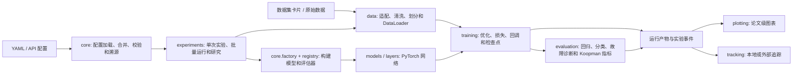

# Joff 技术架构

## 1. 文档目的

本文说明 Joff 当前代码库的模块边界、核心数据流、扩展位置和产物边界。Joff 是面向仿真与过程工业数据的 spec-first PyTorch 实验工具包：实验由配置驱动，数据处理限定在训练集范围内，并将训练、评估、可视化和实验记录组织为可复现的工作流。

## 2. 架构总览



主调用路径为：配置解析 -> 实验编排 -> 数据准备与模型构建 -> 训练 -> 评估 -> 保存运行产物、图表与事件。各层通过明确的 Python 对象与配置对象通信，避免在模块间传递未校验的自由格式字典。

## 3. 目录与文件树

下面的树只列出架构关键节点；每个展示的目录或文件右侧均说明其作用。

```text
paper_project/                                      # 仓库根目录：Joff 源码、数据、配置和测试的统一入口
|- AGENTS.md                                        # 代理协作约定：指向事项追踪、分诊标签和领域文档规则
|- pyproject.toml                                   # Python 包元数据、依赖、构建方式、Pytest 与 Ruff 配置
|- README.md                                        # 英文使用说明、安装方式、公开数据边界和快速示例
|- README.zh-CN.md                                  # 中文使用说明，与 README.md 保持同一产品定位
|- configs/                                         # 可提交的实验配置示例目录
|  `- example.yaml                                  # 最小实验配置样例，不是运行时默认值的权威来源
|- datasets/                                        # 数据资产与公开发布边界
|  |- cards/oa/                                     # 开放获取（OA）数据集卡片：描述格式、任务和预处理约定
|  |- raw/oa/                                       # 开放获取的原始数据，仅包含可公开分发的数据
|  `- manifest.public.yaml                          # 公开数据集清单，供公开版本引用
|- docs/                                            # 项目维护与架构文档
|  |- agents/                                       # 工程技能读取的本地协作约定
|  |  |- issue-tracker.md                           # 本地 Markdown 工单的路径和状态规则
|  |  |- triage-labels.md                           # 分诊角色到实际标签的映射
|  |  `- domain.md                                  # 领域上下文和 ADR 的读取规则
|  `- technical-architecture.md                     # 本文：模块职责、调用关系和扩展边界
|- examples/                                        # 可直接运行的快速上手、冒烟测试和研究工作流脚本
|- src/                                             # 采用 src-layout 的可安装 Python 源码根目录
|  `- joff/                                        # `joff` 包：实验工具包的所有公开运行时能力
|     |- __init__.py                                # 顶层公共 API；导入本身不应读数据、写目录或改变绘图全局状态
|     |- py.typed                                   # 向类型检查器声明该包提供类型信息
|     |- artifacts/                                 # 受限的本地运行产物存储与 JSONL 事件记录基础设施
|     |- console/                                   # Rich 控制台表格、样式和进度显示
|     |- core/                                      # 配置模型、默认值、注册表、工厂、设备和随机种子等基础机制
|     |  |- config.py                               # Pydantic 实验配置 schema 与配置合法性校验
|     |  |- defaults.py                             # 包级和模型级运行时默认值的注册位置
|     |  |- resolver.py                             # 按优先级合并配置，并记录每个字段的来源
|     |  |- registry.py                             # 名称到可构建对象的显式注册表，避免使用 eval/exec
|     |  `- factory.py                              # 从已校验配置构建模型和评估器的公共工厂
|     |- data/                                      # 从原始文件到训练 DataLoader 的数据准备层
|     |  |- adapters/                               # 数据集卡片与特定数据集的适配接口，输出统一 CanonicalDataset
|     |  |- pipeline/                               # 缺失值、异常值、划分、缩放和窗口化等可组合预处理步骤
|     |  |- sources/                                # CSV、Excel、MAT、NPZ 等源文件读取器
|     |  |- datamodule.py                           # 组装数据源、任务、流水线和 PyTorch DataLoader 的主入口
|     |  `- tasks.py                                # 分类、回归、重构、序列和 MPC 等任务定义
|     |- evaluation/                                # 训练后或独立执行的指标与过程故障诊断评估
|     |  |- metrics.py                              # 回归和重构指标
|     |  |- classification.py                       # 分类报告与分类指标
|     |  |- fault_detection.py                     # 基于阈值、残差或潜变量的故障检测流程
|     |  `- koopman.py                              # Koopman 表征相关的贡献分析
|     |- experiments/                               # 把已解析配置编排成完整、可重复的实验工作流
|     |  |- experiment.py                           # 单次实验：准备数据、推导维度、训练、评估和记录
|     |  |- runner.py                               # 运行一个或多个实验配置并汇总结果
|     |  |- study.py                                # 网格、随机、耦合 sweep 和重复实验的研究编排
|     |  `- monitor.py                              # 比较候选结果并维护当前最佳结果
|     |- layers/                                    # 模型共享的激活函数和网络层构建小组件
|     |- models/                                    # MLP、DAE、VAE、NICE、NKN、RNN、注意力、控制和流模型
|     |- plotting/                                  # 可复现的论文与报告图表、主题、配色和图尺寸
|     |- tracking/                                  # 统一追踪协议、本地文件追踪及可选外部平台适配
|     |- training/                                  # Trainer、损失、优化器、回调和模型检查点
|     `- xai/                                      # Jacobian、Hessian 等模型可解释性计算
`- tests/                                           # 单元测试、跨层集成测试和真实数据集迁移测试
   |- test_phase1_core.py                           # 配置、注册表、工厂等基础能力测试
   |- test_phase3_data_pipeline.py                  # 数据适配、预处理、切分和产物摘要测试
   |- test_experiment_training_pipeline.py          # 实验、训练和数据管线的集成测试
   `- test_phase4_phase5_workflows.py               # 研究工作流、追踪、绘图和高级功能测试
```

## 4. 核心分层与职责

| 层 | 主要模块 | 输入 | 输出 | 设计责任 |
| --- | --- | --- | --- | --- |
| 配置层 | `core.config`、`core.defaults`、`core.resolver` | YAML、API 参数、CLI 覆盖、试验覆盖 | 已校验的 `ExperimentConfig`、配置哈希和字段溯源 | 固化配置优先级，拒绝未知字段，并保证同一配置可复现 |
| 构建层 | `core.registry`、`core.factory` | 模型或评估器的 `type` 配置 | 已注册的 Python 对象 | 用显式注册表管理扩展点，防止动态执行任意代码 |
| 数据层 | `data.adapters`、`data.sources`、`data.pipeline`、`DataModule` | 数据集卡片、文件、任务定义、数据流水线 | 统一数据集、处理摘要、训练/测试 DataLoader | 把异构过程数据规范化，并让拟合型预处理仅基于训练集 |
| 模型层 | `models`、`layers` | `ModelConfig` 与推导出的输入输出维度 | `torch.nn.Module` | 提供可配置的模型族和共享网络组件 |
| 训练层 | `training` | 模型、DataLoader、训练配置 | 训练历史、评估指标、检查点 | 管理优化、损失、设备迁移、回调和最佳模型保存 |
| 评估层 | `evaluation` | 预测、真实标签、残差或潜变量 | 结构化评估报告 | 为回归、分类、重构、故障诊断和 Koopman 分析提供一致结果 |
| 实验层 | `experiments` | 解析后的完整配置 | 单次实验结果或研究排行榜 | 协调所有运行阶段，支持 sweep、重复实验和最佳结果筛选 |
| 输出层 | `plotting`、`tracking` | 指标、图形、配置、运行事件 | 图表、事件日志和外部追踪事件 | 让结果可审计、可比较、可用于论文和报告 |

## 5. 关键运行流程

### 5.1 配置解析与溯源

`ConfigManager` 读取 YAML 或 Python 映射，`ConfigResolver` 按以下顺序深度合并：包级默认值 -> 模型默认值 -> 用户配置 -> 试验覆盖 -> API 参数 -> 方法调用覆盖 -> CLI/环境覆盖。合并后由 Pydantic `ExperimentConfig` 校验，并为每一个叶子字段记录来源、生成配置哈希。

这意味着 `configs/example.yaml` 只是用户层输入；真正的默认配置定义在 `src/joff/core/defaults.py`。

### 5.2 数据准备

`DataModule.from_preset(...)` 通过数据集注册表定位适配器。`DatasetCardAdapter` 将 YAML 数据集卡片转为统一的 `CanonicalDataset`，随后 `DataModule` 依据任务定义选择输入和目标列，并组装 `DataPipeline`。

数据流水线包含缺失值处理、异常值规则、顺序/分层/分组切分、训练集归一化和动态窗口等步骤。它输出对应任务的 PyTorch `DataLoader`，供训练层直接消费。

### 5.3 模型构建与训练

`build_model(...)` 使用 `MODEL_REGISTRY` 根据 `model.type` 构建模型。`Experiment` 可从准备好的数据推导模型的输入输出维度，避免把数据维度散落在示例脚本中。`Trainer.fit(...)` 执行 epoch 循环，调用损失函数、优化器、回调和 `CheckpointManager`；训练后可由 `Trainer.evaluate(...)` 返回基础指标。

### 5.4 实验、研究与结果比较

`Experiment` 是单次可复现实验的协调器。`ExperimentRunner` 负责执行一个或多个配置；`Study` 扩展为网格、随机和耦合 sweep，以及重复实验。`BestResultMonitor` 依据指定指标比较候选结果。评估层和绘图层可独立使用，也可由实验工作流产出结果后调用。

## 6. 扩展指南

| 需求 | 推荐扩展位置 | 实现方式 |
| --- | --- | --- |
| 新模型 | `src/joff/models/` | 实现模型类，并通过 `register_model(...)` 注册稳定名称和可选别名 |
| 新评估器 | `src/joff/evaluation/` | 实现 `evaluate(...)` 接口，并通过 `register_evaluator(...)` 注册类型名称 |
| 新数据集 | `datasets/cards/oa/` 与 `data.adapters` | 优先添加数据集卡片；格式特殊时实现 `DatasetAdapter`，输出 `CanonicalDataset` |
| 新预处理步骤 | `src/joff/data/pipeline/` | 实现可组合步骤，并将其加入 `DataPipeline` 的规范化配置流程 |
| 新训练目标或优化策略 | `src/joff/training/` | 在 `losses.py` 或 `optim.py` 添加实现，保持 Trainer 的输入输出约定 |
| 新图表 | `src/joff/plotting/` | 继承或复用 `BasePlotter`、`FigureFactory` 和主题系统，统一通过运行产物保存 |
| 新追踪平台 | `src/joff/tracking/` | 实现 `Tracker` 协议；可通过 `CompositeTracker` 与本地追踪并行使用 |

## 7. 数据与产物边界

- `datasets/raw/oa/` 和 `datasets/cards/oa/` 只放可以公开分发的数据和描述文件。
- 私有数据应放入被 `.gitignore` 排除的 `datasets/raw/private/`、`datasets/cards/private/` 或由用户显式提供本地根目录。
- `runs/`、`outputs/`、`artifacts/`、`checkpoints/`、`mlruns/` 和 W&B 输出均被忽略，不应提交到仓库。
- 绘图应通过 `BasePlotter.save(...)` 和统一的产物存储机制输出 PDF、SVG、PNG，以便复现实验结果。

## 8. 运行产物基础设施

`joff.artifacts` 是由数据、实验、绘图和追踪层共同依赖的基础设施层。`ArtifactStore` 将所有写入限制在当前运行目录内，拒绝绝对路径和目录逃逸；它负责保存 JSON、YAML、CSV 和图表。`RunLogger` 将实验事件以 UTF-8 JSONL 追加到运行目录中。

业务层应通过该模块保存运行产物，而不应自行拼接运行目录或直接写入任意位置。
