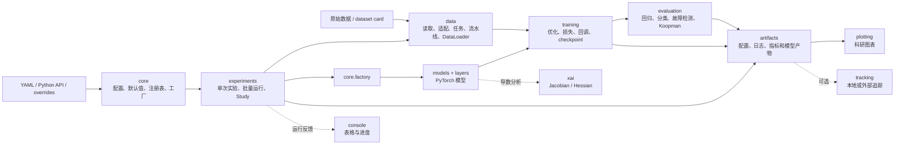
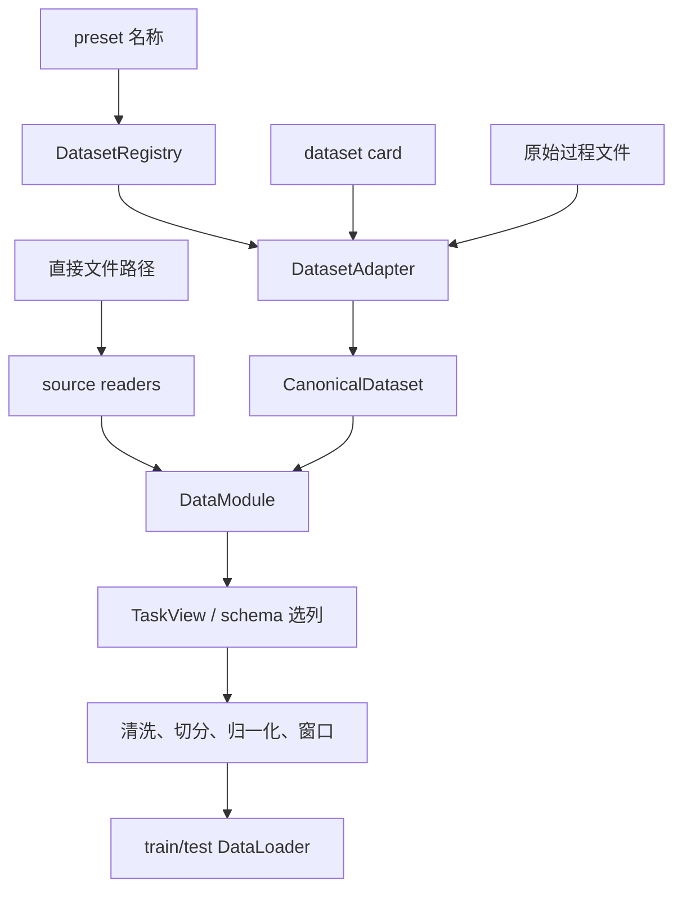
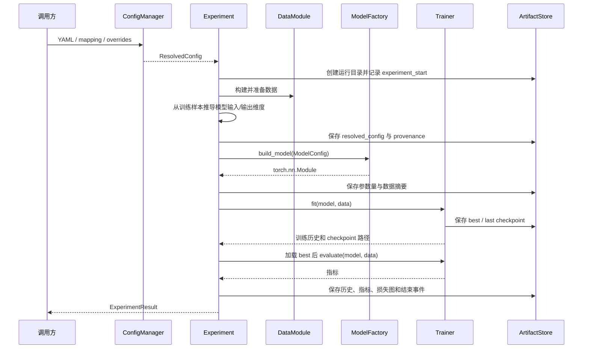

# 技术架构与代码地图

## 1. 文档目标

本文说明 Joff 核心代码的系统边界、分层职责、主调用链、关键对象、扩展接口、当前限制和核心文件地图。文档只讨论 `src/joff` 下的运行时实现，外围示例、测试和协作目录不在代码树中展开。

Joff 是一个面向仿真与过程工业数据的 spec-first PyTorch 实验工具包。它把配置解析、数据准备、模型构建、训练、评估、实验编排和科研输出组织为可复现工作流。

## 2. 架构目标

### 2.1 配置先行

实验行为由严格配置描述。用户配置在进入数据或模型代码前先经过默认值合并、Pydantic 校验、字段溯源和哈希计算。未知字段会被拒绝，避免拼写错误静默改变实验。

### 2.2 数据处理边界明确

原始数据先通过 source reader 和 dataset adapter 转为统一数据结构，再由 `DataModule` 选择任务列并执行数据流水线。需要拟合的预处理器应只使用训练数据，防止测试信息泄漏。

### 2.3 模型与运行流程解耦

模型只实现前向计算和模型专属损失。通用优化、epoch 循环、评估和 checkpoint 由训练层负责；单次实验和研究批次由实验层负责。

### 2.4 结果可追溯

每次配置解析都会生成稳定配置哈希并记录字段来源。实验保存解析后配置、数据摘要、参数量、训练历史、指标、图和 checkpoint，使结果能够追溯到配置与运行目录。

### 2.5 导入保持安静

导入 `joff` 不应读取数据、创建运行目录、启动追踪服务或修改 Matplotlib 全局主题。副作用只在显式调用实验、保存或追踪 API 后发生。

## 3. 总体架构



主路径是：

`配置解析 -> 实验编排 -> 数据准备 -> 模型构建 -> 训练 -> 最佳模型恢复 -> 评估 -> 保存产物`

`plotting`、`tracking`、`console` 和 `xai` 是支持模块。它们可以被主路径调用，但不拥有实验业务状态。

## 4. 分层职责

| 层 | 核心模块 | 输入 | 输出 | 责任边界 |
|---|---|---|---|---|
| 基础层 | `core` | YAML、映射、覆盖参数、类型名称 | `ResolvedConfig`、已注册对象 | 配置、默认值、溯源、哈希、设备、随机种子和显式构建 |
| 数据层 | `data` | 文件、数据集卡片、任务与流水线配置 | `CanonicalDataset`、`DataModule`、`DataLoader` | 读取异构数据并形成训练/测试批次 |
| 模型层 | `models`、`layers` | `ModelConfig` 和批数据 | `torch.nn.Module` 输出字典 | 网络结构、前向计算和模型专属损失 |
| 训练层 | `training` | 模型、DataLoader、优化配置 | 历史、指标、checkpoint | epoch/batch 循环、反向传播、评估和恢复 |
| 评估层 | `evaluation` | 预测、标签、重构量或潜变量 | 结构化报告和扁平指标 | 回归、分类、故障检测和 Koopman 分析 |
| 编排层 | `experiments` | 解析后实验或 Study 配置 | 单次结果、批量结果、排行榜 | 协调下层模块并决定运行顺序 |
| 产物层 | `artifacts` | 配置、表格、图、事件 | 运行目录中的持久化文件 | 限制写入边界并提供统一序列化 |
| 展示层 | `plotting`、`console` | 数据、历史、指标 | Figure、表格、终端信息 | 只负责展示，不改变实验语义 |
| 追踪层 | `tracking` | 配置、指标和产物 | 本地或外部追踪记录 | 用统一协议适配不同追踪后端 |
| 分析层 | `xai` | 可微函数/模型和 Tensor | Jacobian、Hessian | 提供模型导数工具，不负责诊断决策 |

## 5. 配置架构

### 5.1 配置对象

`core/config.py` 使用严格 Pydantic 模型定义：

- `ExperimentConfig`：顶层实验配置；
- `DataConfig`：数据源、preset、任务、切分和流水线；
- `ModelConfig`：模型类型、维度、网络结构和模型专属参数；
- `TrainerConfig`：epoch、优化器、监控指标和最优方向；
- `EvaluationConfig`：评估器类型；
- `ArtifactConfig`：运行产物根目录和运行名称。

所有配置模型继承 `StrictConfig`，默认拒绝额外字段。

### 5.2 配置优先级

`ConfigManager` 与 `ConfigResolver` 按从低到高的顺序合并：

```text
package default
    < model default
    < user config
    < study trial override
    < API kwargs
    < method-call override
    < CLI/environment override
```

后层只覆盖同名叶子字段，其他嵌套字段通过深度合并保留。旧式短参数会先映射为规范 dot-path，例如 `lr` 映射为 `trainer.optimizer.lr`。

### 5.3 配置解析产物

解析结果 `ResolvedConfig` 同时保存：

- 已校验的 `ExperimentConfig`；
- 合并后的原始配置字典；
- 每个叶子字段的来源记录；
- 由规范化配置计算的 16 位 SHA-256 前缀。

实验在根据数据推导 `input_dim` 或 `output_dim` 后，会把推导值记录为 `derived:data_schema`，从而区分用户输入和运行时推导。

## 6. 数据架构

### 6.1 数据进入系统的两条路径



**Preset 路径**用于仓库已知数据集。注册表解析名称，适配器读取专用文件并输出 `CanonicalDataset`。

**直接文件路径**用于通用 CSV、Excel、MAT、NPY 或 NPZ。source reader 先转换为统一表格/数组，再由 `DataModule` 处理。

### 6.2 统一数据对象

- `Segment`：一段表格数据及其分段元数据；
- `CanonicalDataset`：按 split 保存多个 segment，并携带 schema 和来源摘要；
- `DataSchema`：定义列名、角色和采样元数据；
- `TaskSchema`：定义某任务使用哪些输入、目标和标签；
- `TaskView`：根据 schema 从 DataFrame 产生任务数组；
- `DataModule`：最终拥有 PyTorch dataset、DataLoader 和处理摘要。

### 6.3 数据流水线

`DataPipeline` 接受映射、步骤列表或 YAML，并规范化为稳定步骤名。当前支持：

- schema 校验；
- 缺失值处理；
- 异常值处理；
- 数据切分；
- 归一化；
- 插补掩码；
- 动态窗口；
- 序列样本；
- MPC 窗口；
- PyTorch dataset 转换。

流水线配置可以来自数据集默认值、任务默认值和实验显式覆盖。合并后保存摘要，便于检查实际生效的处理步骤。

### 6.4 数据不变量

- schema 和 task 决定输入/目标语义，模型不自行猜测原始列。
- 拟合型清洗和缩放应只从训练 split 学习参数。
- 官方 train/test 数据应保持官方边界。
- 时间序列任务应保留顺序，只有明确允许时才 shuffle。
- `DataModule.save_summaries(...)` 应保存来源、切分和预处理摘要。

## 7. 模型与训练架构

### 7.1 模型注册与构建

内置模型在 `models/__init__.py` 中导出并注册。`build_model(...)` 的处理过程是：

1. 接受 `ModelConfig` 或映射；

2. 确保内置模型已经延迟注册；

3. 根据 `model.type` 从 `MODEL_REGISTRY` 查找构造器；

4. 使用完整 `ModelConfig` 构建模型；

5. 遇到未知名称时返回带合法选项的构建错误。

显式注册表替代 `eval`/`exec` 和任意动态导入，扩展点更容易审计。

### 7.2 统一模型约定

大多数模型继承 `BaseModel`，遵循以下约定：

- 构造时保存规范化 `ModelConfig`；
- `forward(batch)` 返回 Tensor 或包含 `prediction`、`reconstruction`、`latent` 等字段的字典；
- `compute_loss(batch, output, ...)` 返回总损失和可选分项损失；
- `to_config()` 返回可序列化模型配置；
- 兼容 `Trainer` 的 fit/test/load 路径。

`batch_inputs(...)` 与 `batch_targets(...)` 统一处理 Tensor、tuple/list 和字典批数据，避免具体模型重复解析 DataLoader 输出。

### 7.3 Trainer 职责

`Trainer` 负责：

- 解析运行设备并设置随机种子；
- 构建优化器；
- 对训练批执行前向、损失、反向传播和参数更新；
- 对测试/验证 loader 做无梯度评估；
- 汇总总损失和分项指标；
- 调用 callback；
- 保存 last 和按监控指标选择的 best checkpoint；
- 返回结构化训练历史与 checkpoint 路径。

Trainer 不负责读取原始文件，也不决定数据集任务语义。

### 7.4 Checkpoint 内容

`CheckpointManager` 保存：

- 模型类型和参数；
- 优化器状态；
- epoch 与指标；
- 模型配置和完整解析配置；
- Python、NumPy、PyTorch 及可选 CUDA 随机状态；
- 额外运行状态和 UTC 保存时间。

恢复时可以只恢复模型，也可以恢复优化器和其他状态。

## 8. 评估架构

评估器与模型使用相同的注册表/工厂模式。当前主要评估能力为：

| 评估器 | 输入 | 主要输出 |
|---|---|---|
| `RegressionEvaluator` | 真实值、预测值 | MSE、RMSE、MAE、R2、MaxAbs |
| `ReconstructionEvaluator` | 原始值、重构值 | 总体和逐变量重构误差 |
| `ClassificationEvaluator` | 标签、类别或 logits | 准确率和分类汇总 |
| `FaultDetectionEvaluator` | 正常分数、测试分数、二元标签 | 阈值、FAR、MDR、FDR |
| `KoopmanContributionEvaluator` | NKN 前向输出 | 一阶/二阶贡献、比例、稀疏度和维度 |

故障检测评估器采用显式 `fit(normal_scores)` 与 `evaluate(test_scores, labels)` 两阶段接口，使正常阈值拟合和测试评价在 API 上分开。

当前 `Experiment.run()` 默认调用 `Trainer.evaluate()` 生成基础训练任务指标；`EvaluationConfig` 尚未自动编排所有独立评估器。论文专用检测和隔离评估需要在实验层增加明确调用，而不能只在配置中填写类型后假定它会执行。

## 9. 实验编排架构

### 9.1 单次实验时序



`ExperimentResult` 返回运行目录、解析配置、溯源、模型、历史、指标、checkpoint 路径和数据摘要，既可供脚本继续处理，也可供 runner/study 聚合。

### 9.2 批量运行

`ExperimentRunner` 接受一组独立实验配置，逐一运行并保存汇总。单个实验失败时，runner 可以记录失败而不丢失已完成结果。

### 9.3 Study

`Study` 在单次实验之上增加：

- grid sweep；
- 随机采样 sweep；
- 多字段 coupled 参数组合；
- 固定列表、偏移或 spawn 随机种子重复；
- 排名指标、最小/最大方向和约束；
- leaderboard、失败统计和最佳结果导出。

Study 只负责展开配置与聚合结果，不应在内部重新定义模型或数据语义。

## 10. 产物与追踪架构

### 10.1 ArtifactStore

`ArtifactStore(root, name)` 创建一个运行目录。所有保存路径必须是相对于该运行目录的安全路径；绝对路径和目录逃逸会被拒绝。

支持保存：

- JSON；
- YAML；
- CSV/表格；
- Matplotlib Figure；
- 由调用方组织的任意子目录结构。

### 10.2 RunLogger

`RunLogger` 以 UTF-8 JSONL 追加结构化事件。单次实验当前至少记录开始、模型构建、评估和结束事件。

### 10.3 Tracker

`Tracker` 协议定义开始运行、记录配置、记录指标、记录产物/图和结束运行。当前实现包括：

- `LocalTracker`；
- `CompositeTracker`；
- 可选 TensorBoard、MLflow 和 W&B 适配器。

外部追踪依赖使用延迟导入。没有安装可选依赖时，导入 Joff 本身仍应成功。

## 11. 扩展接口

| 扩展需求 | 推荐位置 | 必须遵守的接口 |
|---|---|---|
| 新模型 | `models` | 继承/兼容 `BaseModel`，实现 forward 和 compute_loss，并调用 `register_model` |
| 新评估器 | `evaluation` | 返回结构化报告，调用 `register_evaluator`，明确 fit/evaluate 数据边界 |
| 新数据集 | `data.adapters` | 实现 `DatasetAdapter`，输出 `CanonicalDataset` 和 schema/task 元数据 |
| 新源文件格式 | `data.sources` | 读取后输出统一 DataFrame/数组，不混入任务逻辑 |
| 新流水线步骤 | `data.pipeline` | 配置可序列化，明确 fit/transform 阶段，更新流水线规范化入口 |
| 新损失或优化器 | `training` | 保持 Trainer 输入输出约定，不把数据读取放入损失函数 |
| 新研究策略 | `experiments.study` | 只展开配置和聚合结果，复用单次 Experiment |
| 新追踪后端 | `tracking` | 实现 `Tracker` 协议，保持可选依赖延迟导入 |
| 新图表 | `plotting` | 复用 `BasePlotter`、`FigureFactory` 和局部主题 |

## 12. 本论文方法的推荐落点

“受保护 Koopman–T–S 未知故障检测与结构化隔离”不应全部写进一个脚本。按现有边界，推荐拆分为：

| 论文能力 | 推荐模块 | 原因 |
|---|---|---|
| 严格过去编码、T–S 规则和局部 Koopman 动力学 | `models` | 属于可训练模型结构和前向动力学 |
| 自由多步状态/输出损失 | `training.losses` 或模型 `compute_loss` | 属于训练目标，需要和模型输出契约一致 |
| 候选起点、受保护参考、冻结与恢复状态机 | `evaluation` 下的新模块 | 属于冻结模型后的在线监测状态，不应污染 Trainer |
| 联合残差、条件白化和多尺度阈值 | `evaluation` 下的新评估器 | 需要明确 normal fit 与 online evaluate 边界 |
| 传感器屏蔽预测 | 模型组件在 `models`，隔离逻辑在 `evaluation` | 训练网络与告警后的诊断决策应分离 |
| Jacobian 和有限时间输入响应空间 | `xai` 提供导数底层，隔离模块负责业务组合 | 避免把故障语义硬编码进通用 Jacobian 工具 |
| 端到端论文实验 | `experiments` 的专用编排入口 | 负责训练、独立正常校准、冻结和最终故障测试顺序 |
| 论文图表 | `plotting` | 统一尺寸、主题和保存方式 |

该论文尤其需要扩展当前仅有 train/test 的通用路径，显式区分：

`normal train -> normal validation -> normal calibration -> frozen fault test`

这属于实验和数据协议的核心变化，不能只在测试脚本里临时切数组。

## 13. 当前架构限制

- 通用 `Experiment` 主要覆盖训练和基础测试指标，尚未自动执行任意 `EvaluationConfig`。
- `DataModule` 的主抽象是 train/test；论文所需独立 validation/calibration 需要新增正式边界。
- 当前 NKN 是单一学习动力学，不是老师 PDF 中带可学习规则权重的完整 Koopman–T–S 模型。
- 当前故障检测器提供基础正常阈值和 FAR/MDR/FDR，不包含受保护参考、条件动态阈值或结构化隔离。
- tracking 已有协议和实现，但单次 `Experiment` 当前以本地 `ArtifactStore`/`RunLogger` 为主，外部 tracker 不是默认主调用链的一部分。
- `DataModule` 体量较大，集中了多种任务和数据模式；新增论文数据协议时应优先提取明确组件，避免继续把在线诊断逻辑加入该文件。

这些限制是后续扩展边界，不应在论文或项目说明中写成已经完成的能力。

## 14. 架构不变量

后续开发应持续满足：

1. 相同解析配置、数据版本和随机种子应产生可比较运行。

2. 配置未知字段必须失败，不能静默忽略。

3. 数据 schema 和 task 决定列语义，模型不得直接依赖特定原始列名。

4. 拟合型数据处理只能从允许的训练数据学习参数。

5. 模型不创建实验目录，Trainer 不读取原始数据文件。

6. 单次实验负责组合，Study 只负责配置展开和结果聚合。

7. 每个论文结果必须能够追溯到解析配置、数据摘要、checkpoint 和逐次运行产物。

8. 可选追踪和绘图依赖不得让基础包导入失败或产生全局副作用。

## 15. 核心代码地图

下面只展示 `src/joff` 中的核心运行时代码。每个条目右侧的注释说明其主要职责。

```text
src/                                              # Python 源码根目录，采用 src-layout
`-- joff/                                        # Joff 主包，包含实验运行时的全部核心实现
    |-- __init__.py                              # 顶层公共 API，统一导出常用配置、数据、模型、训练和评估对象
    |-- py.typed                                 # 声明包内类型标注可供外部类型检查器使用
    |
    |-- artifacts/                               # 运行产物与事件日志基础设施
    |   `-- __init__.py                          # 实现 ArtifactStore 和 RunLogger
    |
    |-- core/                                    # 配置、注册、构建、设备和复现基础能力
    |   |-- config.py                            # Pydantic 严格配置模型
    |   |-- defaults.py                          # 包级和模型级默认配置
    |   |-- resolver.py                          # 配置加载、合并、校验、溯源和哈希
    |   |-- provenance.py                        # 配置字段来源记录
    |   |-- registry.py                          # 名称、别名和构造对象的显式注册表
    |   |-- factory.py                           # 根据 type 构建模型和评估器
    |   |-- device.py                            # CPU、CUDA 和 auto 设备解析
    |   |-- seed.py                              # Python、NumPy 和 PyTorch 随机种子
    |   `-- errors.py                            # 配置、注册和构建异常类型
    |
    |-- data/                                    # 从原始文件到 PyTorch DataLoader 的数据层
    |   |-- datamodule.py                        # 数据读取、任务选列、预处理、切分、窗口和 DataLoader 主入口
    |   |-- tasks.py                             # 分类、回归、重构、序列和 MPC 任务视图
    |   |-- schema/                              # 数据列、任务和分段元数据定义
    |   |   `-- __init__.py                      # ColumnSpec、DataSchema、TaskSchema 和 SegmentInfo
    |   |-- sources/                             # 通用源文件读取边界
    |   |   `-- readers.py                       # CSV、Excel、MAT、NPY 和 NPZ 读取器
    |   |-- adapters/                            # 数据集专用适配层
    |   |   |-- base.py                          # DatasetAdapter 协议和 CanonicalDataset
    |   |   |-- registry.py                      # 数据集 preset 注册和别名解析
    |   |   |-- builtin.py                       # 内置数据集注册
    |   |   `-- real_process.py                  # CSTR、TE、TTS 和多相流等过程数据解析
    |   `-- pipeline/                            # 可组合数据预处理步骤
    |       |-- base.py                          # 表格序列、窗口样本和基础数据容器
    |       |-- compose.py                       # 流水线配置规范化和合并
    |       |-- missing.py                       # 缺失值处理
    |       |-- imputation.py                    # 插补掩码和样本
    |       |-- outliers.py                      # 训练异常值处理
    |       |-- scaling.py                       # 标准化和稳健缩放
    |       |-- split.py                         # 顺序和动态分布切分
    |       `-- windowing.py                     # 时间窗、序列和 MPC 窗口
    |
    |-- layers/                                  # 模型共享的轻量网络组件
    |   |-- activations.py                       # 激活函数解析
    |   `-- builder.py                           # 全连接层和共享网络结构构建
    |
    |-- models/                                  # 可配置构建的 PyTorch 模型族
    |   |-- __init__.py                          # 内置模型导出和注册
    |   |-- base.py                              # BaseModel、批数据解析和模型损失约定
    |   |-- mlp.py                               # 多层感知机
    |   |-- autoencoder.py                       # AE 和 DAE
    |   |-- vae.py                               # 变分自编码器
    |   |-- flow.py                              # NICE 可逆流
    |   |-- koopman.py                           # NKN 和 Koopman 潜在动力学
    |   |-- rnn.py                               # RNN、GRU 和 LSTM
    |   |-- attention.py                         # 掩码注意力和 Attention 预测模型
    |   |-- control.py                           # ARX、Observer 和控制相关模型
    |   `-- gan.py                               # GAN/WGAN 组件
    |
    |-- training/                                # 通用训练循环和训练状态管理
    |   |-- trainer.py                           # epoch/batch 循环、评估和 checkpoint 协调
    |   |-- optim.py                             # 优化器构建
    |   |-- losses.py                            # 预测、NICE 和 Koopman 相关损失
    |   |-- callbacks.py                         # 训练回调
    |   `-- checkpoint.py                        # 模型、优化器、配置和随机状态保存恢复
    |
    |-- evaluation/                              # 模型输出到结构化指标的评估层
    |   |-- __init__.py                          # 内置评估器注册和导出
    |   |-- metrics.py                           # 回归和重构指标
    |   |-- classification.py                    # 分类指标
    |   |-- fault_detection.py                   # 正常阈值、T2/Q/SPE 和 FAR/MDR/FDR
    |   `-- koopman.py                           # Koopman 一阶/二阶贡献分析
    |
    |-- experiments/                             # 单次实验、批量运行和参数研究编排
    |   |-- experiment.py                        # 单次实验主调用链
    |   |-- runner.py                            # 多配置顺序运行和汇总
    |   |-- study.py                             # sweep、重复种子和排行榜
    |   `-- monitor.py                           # 最佳结果比较和维护
    |
    |-- plotting/                                # 统一主题和尺寸的科研绘图
    |   |-- base.py                              # 绘图器公共接口
    |   |-- figure.py                            # 论文图尺寸和 FigureFactory
    |   |-- theme.py                             # 局部 Matplotlib 主题
    |   |-- data.py                              # 数据分布和异常点图
    |   |-- training.py                          # 损失曲线
    |   |-- prediction.py                        # 预测图
    |   |-- fault_detection.py                   # 故障统计量和阈值图
    |   |-- koopman.py                           # Koopman 贡献图
    |   `-- flow.py                              # 潜空间分布图
    |
    |-- tracking/                                # 本地和可选外部实验追踪
    |   |-- base.py                              # Tracker 协议和组合追踪器
    |   |-- local.py                             # 本地产物追踪
    |   `-- optional.py                          # TensorBoard、MLflow 和 W&B 适配器
    |
    |-- xai/                                     # 模型导数和可解释性工具
    |   `-- jacobian.py                          # Jacobian、批量 Jacobian 和 Hessian
    |
    `-- console/                                 # 命令行信息、表格和进度显示
        |-- console.py                           # 统一 Rich/普通文本输出
        |-- tables.py                            # 配置和指标表格
        |-- progress.py                          # 进度报告器
        `-- style.py                             # 控制台主题
```

### 15.1 源码阅读顺序

1. 先读 `experiments/experiment.py`，理解一次实验如何串联所有模块。

2. 再读 `core/config.py` 和 `core/resolver.py`，理解配置来源和覆盖优先级。

3. 阅读 `data/datamodule.py`，理解原始数据如何变成训练批次。

4. 阅读 `core/factory.py`、`models/base.py` 和目标模型文件，理解模型构建与输出约定。

5. 阅读 `training/trainer.py`，理解训练、评估和 checkpoint。

6. 阅读 `evaluation`，理解预测如何转成论文指标。

7. 最后阅读 `experiments/study.py`，理解 sweep、重复实验和结果聚合。
