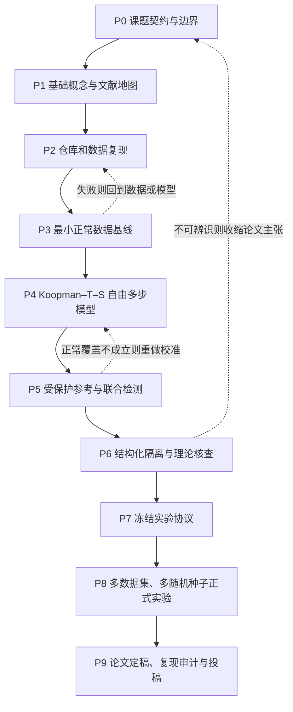

# 从零完成“受保护 Koopman–T–S 未知故障检测与结构化隔离”论文的完整路线

## 0. 先给结论：现在到底应该先做什么

不要先闷头写完整论文，也不要一开始就跑大规模实验，更不要连续几周只看文献而没有代码产物。

这篇论文应采用四条同步但有先后主次的工作线：

1. **课题理解线**：先把老师稿中的对象、假设、方法和结论翻译成自己能讲清楚的话。

2. **文献线**：围绕明确的问题查文献，确认创新边界、常用基线和评价规范，而不是无目的地泛读。

3. **实验线**：先复现仓库现成流程，再做最小基线，最后逐模块加入论文方法；每加入一个模块就做一次消融。

4. **写作线**：第一周就建立论文骨架、术语表、符号表和实验记录，但只有得到证据后才能写结果与结论。

推荐的第一阶段顺序是：

`读懂老师稿 -> 建立概念清单 -> 跑通仓库最小示例 -> 精读核心文献 -> 确认研究问题和数据 -> 做最小基线 -> 实现完整方法 -> 冻结实验协议 -> 正式重复实验 -> 完成论文`

前三到五天的目标不是“做出创新”，而是让自己能够回答以下五个问题：

- 这篇论文要解决什么实际问题？
- 为什么普通的在线预测残差可能漏检？
- “仅基于正常数据”具体限制了训练、调参和阈值校准的哪些环节？
- 受保护正常参考、全维联合残差和结构化隔离各自解决什么问题？
- 当前仓库已经具备什么，还缺什么？

只有能不看 PDF 用五分钟讲清以上问题，才进入正式方法开发。

---

## 1. 这篇论文的点子到底是什么

### 1.1 用最朴素的话说明

系统正常运行时，用过去一段时间的控制输入和传感器输出学习一个“正常系统如何变化”的模型。系统上线后，同时维护两条轨迹：

- **实际数据轨迹**：持续读取新测量，用于描述系统现在实际发生了什么。
- **受保护的正常参考轨迹**：只从已经延迟确认正常的历史起点出发，使用冻结模型和实际记录的控制指令自由预测，不再让新测量修正它。

如果异常发生后还不断用异常测量更新“正常参考”，参考轨迹可能跟着异常系统一起移动，残差反而变小。受保护参考的核心目的就是避免这种“正常模型吸收异常”的现象。

检测时比较三种关系：

- 当前输出与正常解码输出是否一致，即输出残差 $r^y_k$；
- 最近一个短时间窗内，自由预测是否逐渐偏离，即短期残差 $r^S_k$；
- 从最近安全起点出发的长期正常参考是否逐渐偏离，即长期残差 $r^L_k$。

把三种残差联合归一化后做多时间尺度检测。发生告警后，不直接声称知道具体物理故障，而是判断异常主要破坏了哪一种正常关系：

- 某个传感器自身关系异常；
- 异常主要能被正常输入通道的响应解释；
- 异常包含输入通道解释不了的过程侧成分；
- 信息不足或多个成分混合，拒绝强行分类。

### 1.2 论文最核心的技术矛盾

这篇论文的核心不是简单地“把 Koopman 和 T–S 拼在一起”，而是解决以下矛盾：

> 在线模型需要读取新测量才能知道实际系统状态，但正常参考如果也读取新测量，就可能吸收异常；如果完全不读取新测量，自由预测误差又会随时间积累。

论文需要同时回答：

- 如何把“读取实际系统”和“生成正常参照”分成两条支路？
- 如何证明正常自由预测在有限时间内仍可信？
- 如何让阈值随输入、运行区域和参考持续时间变化？
- 不知道故障方向时，如何避免投影后产生不可见异常方向？
- 没有故障样本和故障模型时，隔离最多能做到什么程度？

### 1.3 必须一直守住的研究边界

老师稿规定了很严格的数据条件：

- 训练模型时只能用正常数据。
- 不能用故障样本训练分类器或挑选最优超参数。
- 不预先知道故障方向、作用位置、幅值和时间形式。
- 不假定存在可微的“故障参数到输出”机理模型。
- 控制器发出的指令 $u_k$ 和外生工况应可信记录。
- 故障数据只能在实验协议冻结后用于最终评价，不能反向影响训练、阈值和模型选择。

“仅正常数据”不等于实验中完全不能出现故障数据。正确含义是：**故障数据只能作为最终测试集，用来评价检测和隔离能力，不能参与学习和选择。**

### 1.4 论文中“结构化隔离”的准确含义

结构化隔离不是在信息不足时猜一个具体损坏部件，而是判断哪类正常关系被破坏：

- 传感器通道级异常；
- 可由执行器等效输入偏差解释的异常；
- 正常输入响应空间外的过程侧或未建模异常；
- 混合异常或不可辨识情形。

必须保留“信息不足”输出。若过程异常和执行器异常产生完全相同的输入输出作用，仅凭现有数据无法唯一分离；论文应把这一点作为可辨识性边界，而不是算法失败。

---

## 2. 当前材料与仓库现状

### 2.1 老师 PDF 的性质

老师提供的 PDF 是一份完整的理论蓝图，共 7 页，已经给出：

- 研究问题、假设和三项核心贡献；
- 受保护正常参考与延迟确认机制；
- 统一多步残差及其非线性传播；
- 完整 Koopman–T–S Jacobian 与有限时间误差界；
- 三类联合残差、多时间尺度统计量和条件阈值；
- 传感器屏蔽预测、输入响应空间和分层隔离逻辑；
- 6 个命题/定理、2 个算法和 21 条起始参考文献。

但是它没有真实实验章节、数据处理细节、实现参数、对比结果和重复性统计。因此它不是可以直接提交的成稿，更不能把其中的理论陈述自动当作已经被实验支持的结论。

### 2.2 当前仓库可以直接复用的能力

| 能力 | 当前状态 | 对本论文的用途 |
|---|---|---|
| 配置、随机种子、实验产物记录 | 已有 | 组织可复现实验 |
| CSTR、闭环 CSTR、TTS、TE、多相流等数据适配器 | 已有 | 候选实验数据 |
| MLP、DAE、NKN/基础 Koopman 等模型 | 已有 | 基线和部分模型组件 |
| 时间窗口、训练集归一化、官方划分 | 已有 | 数据管线基础 |
| Jacobian/Hessian 自动微分工具 | 已有 | 完整 Jacobian 分析的底层能力 |
| 正常分数阈值、FAR/MDR/FDR | 已有 | 基础检测评价 |
| sweep、重复实验、checkpoint、绘图 | 已有 | 超参数研究和论文图表 |

2026-07-21 的本地检查结果：核心配置测试 `tests/test_phase1_core.py` 的 9 个测试通过；合成 CSTR 故障检测冒烟示例和真实 CSTR 数据加载示例能够运行。完整测试套件在 120 秒检查窗口内未结束，因此这里只能确认基础路径可运行，不能据此声明整个仓库已完全验证。

### 2.3 当前仓库尚未提供的论文核心模块

下列内容需要为本论文新增或重构，不能误认为已经实现：

- 严格过去历史编码器 $E_\vartheta$；
- 可学习 T–S 调度网络、规则权重和局部 Koopman 动力学；
- 与在线一致的自由多步训练损失；
- 短期滚动预测器和长期受保护参考；
- 候选起点、延迟确认、告警冻结和恢复状态机；
- 联合残差 $R_k=\operatorname{col}(r^y_k,r^S_k,r^L_k)$；
- 输入、规则区域和参考持续时间条件下的均值、协方差与阈值；
- 对最大多尺度统计量的独立正常块校准；
- 传感器历史屏蔽训练与通道残差；
- 有限时间输入响应矩阵、执行器等效解释和过程侧正交剩余；
- 执行器通道可分裕度、拒识逻辑和隔离指标；
- 与 PDF 中定理逐项对应的数值验证。

因此，仓库是实验底座，不是论文方法的现成实现。

### 2.4 推荐的首要数据集

按题目“闭环非线性系统”的匹配程度，推荐优先级为：

1. **闭环 CSTR**：作为开发和主实验数据集。系统低维、闭环属性明确，适合逐步调试残差、输入响应空间和可视化。

2. **TTS 三容水箱**：作为第二个非线性系统验证泛化，也与老师稿参考文献中的三容水箱实验方向接近。

3. **TE 过程**：作为可选的大规模复杂过程实验。维度更高、故障更多，但不适合新手作为第一调试对象。

最终数据集必须由导师确认。仓库数据卡中的许可证仍标记为 `to_verify`，投稿前必须核实数据来源、许可和正确引用。

---

## 3. 需要补的基础知识及学习顺序

不要试图一次学完控制理论、机器学习和统计检测。按“完成当前模块所需的最小知识”学习。

### 3.1 第一层：一周内必须掌握

| 概念 | 至少要会什么 | 如何自测 |
|---|---|---|
| 离散时间状态空间模型 | 区分状态、输入、输出、扰动和故障 | 能解释 $x_{k+1}=f(x_k,u_k)$ 与 $y_k=g(x_k,u_k)$ |
| 开环与闭环 | 理解控制输入会响应过去测量 | 能解释为何条件于已实现的 $u_k$ 比较健康轨迹 |
| 故障检测、隔离、估计 | 区分“有没有”“在哪里/哪类”“多大” | 能给三者各举一个例子 |
| 训练/验证/校准/测试 | 理解四者用途及数据泄漏 | 能解释阈值为何不能用故障测试集拟合 |
| 时间序列窗口 | 严格过去、预测起点、预测长度 | 能画出 $H^-_k$ 包含哪些样本 |
| 残差和阈值 | 正常关系破坏会使残差变化 | 能解释 FAR、MDR、FDR 和检测延迟 |
| 自动编码器/预测器 | 重构异常与动态预测异常的区别 | 能说明静态 DAE 为什么可能漏掉纯动态异常 |

### 3.2 第二层：开始实现模型前掌握

| 概念 | 学习目标 |
|---|---|
| Koopman 算子与有限维升维 | 理解非线性系统在学习坐标中近似线性演化的思想；区分无限维算子和有限维矩阵 |
| 深度 Koopman/NKN | 理解编码、潜在动力学、解码和一步/多步损失 |
| T–S 模糊模型 | 理解规则、隶属度、归一化权重和局部线性模型凸组合 |
| 自由递推与教师强制 | 理解为什么训练时每步喂入真实状态会掩盖在线误差积累 |
| Jacobian 与链式法则 | 理解状态变化如何同时改变局部动力学和规则权重 |
| 协方差与白化 | 理解联合残差中不同量纲和相关性为何必须一起处理 |

### 3.3 第三层：做理论和隔离前掌握

| 概念 | 学习目标 |
|---|---|
| 有限时间误差传播 | 能从一步递推推导多步范数上界和可靠预测长度 |
| 统计假设检验与 GLRT | 理解未知均值变化下全维二次统计量的来源 |
| 分位数/Conformal 校准 | 理解独立校准块、有限样本覆盖和时间相关性限制 |
| 线性代数中的列空间、投影、伪逆 | 理解“可由输入通道解释的成分”和正交剩余 |
| 奇异值与可辨识性 | 理解执行器通道可分裕度为何由最小奇异值刻画 |
| 可检测性与可隔离性边界 | 接受某些异常从现有输入输出中理论上不可区分 |

### 3.4 概念学习的正确方法

每个概念都按以下闭环学习：

1. 用一页中文笔记写“定义、直觉、一个二维例子、在本文中的位置”。

2. 手算或画图说明最小例子。

3. 在仓库里找到对应代码或写一个极小测试。

4. 用自己的话录音或口述三分钟。

5. 把仍讲不清的点变成具体问题，再查教材或问导师。

只收藏资料、不做例子、不回到本文问题，通常不会形成可用理解。

---

## 4. 文献检索与阅读流程

### 4.1 先从老师稿的 21 条文献建立“种子库”

阅读顺序不要按参考文献编号从头到尾，而应按问题分组：

1. **基础建模**：T–S 原始论文 [1]，Koopman 基础及控制 [2]–[4]。

2. **最接近工作**：Koopman 故障检测、传感器隔离和三容水箱实验 [5]–[8]。

3. **T–S 观测与不可测调度**：[9]–[11]。

4. **故障诊断和检测理论**：[12]–[16]。

5. **正常数据阈值与时间序列校准**：[17]–[19]。

6. **矩阵与优化工具**：[20]–[21]，需要推导时再查，不必第一周通读。

PDF 中的条目只是检索起点。每条文献都要在 IEEE Xplore、出版社页面、Crossref 或作者主页核对题名、作者、年份、卷期、页码和 DOI；未核实前不要直接进入最终参考文献库。

### 4.2 围绕六条检索线扩展

建议使用下列英文组合词检索近五年工作，并通过综述和高被引论文向前追溯：

- `Koopman fault detection isolation nonlinear systems`
- `deep Koopman normal data anomaly detection time series`
- `Takagi Sugeno data driven fault diagnosis unmeasurable premise`
- `free running multi step Koopman prediction stability`
- `dynamic threshold residual fault detection closed loop`
- `conformal calibration time series anomaly detection normal data`

还应专门检索以下可能最接近本文创新的表达：

- `protected reference trajectory fault detection`
- `frozen nominal model anomaly detection`
- `fault accommodation residual absorption observer`
- `input response subspace actuator process fault isolation`
- `masked sensor prediction fault isolation`

### 4.3 每篇文献三遍阅读

第一遍只用 10 分钟判断是否相关：看摘要、图、结论和实验表。

第二遍回答固定问题：

- 数据条件是什么？正常数据还是使用了故障样本？
- 模型需要哪些已知量？是否知道故障方向或故障通道？
- 在线状态是否持续由当前测量更新？
- 检测残差、阈值和隔离逻辑是什么？
- 用了哪些数据集、基线和指标？
- 论文真正证明了什么，哪些只是实验观察？

第三遍只针对需要复现或引用的论文，细读公式、实现细节和附录。

### 4.4 建立文献矩阵

建议维护 `docs/文献矩阵.md`，每篇论文一行，至少包含：

| 字段 | 说明 |
|---|---|
| Citation key | 唯一引用键 |
| Problem | 检测、隔离、估计或预测 |
| Plant/data | 系统和数据来源 |
| Training data | 是否使用故障样本 |
| Fault prior | 是否知道故障方向/通道/模型 |
| Model | Koopman、T–S、AE、观测器等 |
| Online update | 是否持续吸收新测量 |
| Residual | 使用的残差 |
| Threshold | 固定、统计、动态或理论阈值 |
| Isolation | 如何隔离，能到什么粒度 |
| Theory | 定理和假设 |
| Metrics | FAR、FDR、delay 等 |
| Limitation | 可被本文解决的限制 |
| Reproducible | 代码/数据是否可得 |

### 4.5 文献阶段的完成标准

达到以下条件就应停止第一轮扩展检索，转入实验：

- 精读 8–12 篇与课题直接相关的论文；
- 泛读并分类 25–40 篇论文；
- 找到至少 3 类公平基线；
- 能用一张表说明本文与最接近的 5 篇论文的差别；
- 能指出“受保护参考”是否已有同义方案，以及本文仍缺的证据；
- 导师确认创新表述没有明显撞车。

此后文献检索按实验和写作中的具体缺口增量进行，不再无限扩展。

---

## 5. 端到端研究流程和阶段门



任何阶段没有达到“通过条件”，不要靠增加训练轮数直接跳到下一阶段。

### P0：形成一页研究契约

**预计时间：1–2 天。**

需要写清：

- 研究对象：闭环非线性系统；
- 可用数据：正常训练输入、输出、外生工况和可信控制指令；
- 禁止使用：故障训练样本、故障方向和故障作用模型；
- 核心问题：在线正常参考可能吸收异常；
- 目标输出：检测、结构类别、拒识/信息不足和恢复状态；
- 暂定主数据集和第二数据集；
- 预期贡献及每项贡献需要的理论和实验支撑。

**通过条件：** 导师确认题目边界、主数据集、是否必须做真实装置实验、目标期刊/会议和计划周期。

### P1：补基础并完成第一轮文献地图

**预计时间：1–2 周，可与 P2 交叉。**

产物：

- 概念词典；
- 论文结构图；
- 文献矩阵；
- 最接近工作对比表；
- 暂定基线和指标；
- 一份“已知、未知、待导师确认”列表。

**通过条件：** 能独立讲清论文方法流程，且创新点已经由文献对比而不是个人感觉支持。

### P2：跑通仓库并完成数据审计

**预计时间：2–4 天。**

先运行：

```powershell
python -m pip install -e ".[dev,paper,hdf5]"
python -m pytest tests/test_phase1_core.py -q
python examples/fd_cstr.py --smoke
python examples/data_preset_cstr_fd.py
```

然后完成每个候选数据集的审计：

- 每个文件的 shape、变量名、物理含义、采样周期和单位；
- 哪些列是控制输入、系统输出、外生工况、状态和故障标签；
- 正常训练段是否真的完全正常；
- 故障注入时刻、持续时间、类型、通道和幅值；
- 是否有多次独立运行，还是一条长时间序列；
- 是否存在预先归一化、乱序、重复、缺失或异常值；
- 官方 train/test 划分是否满足“正常训练、故障仅测试”；
- 数据来源、许可、引用和可公开性。

现有 `examples/data_preset_cstr_fd.py` 只是数据加载和小模型演示，不是论文基线；`examples/fd_cstr.py` 使用合成数据，其数值只能验证代码路径，不能写入论文结果。

**通过条件：** 能从原始文件生成固定的数据审计报告；同一配置重复加载得到相同切分；所有拟合型预处理只在正常训练段上拟合。

### P3：建立最小正常数据基线

**预计时间：1 周。**

先做简单且能解释的基线，不要直接实现全部创新：

- PCA/动态 PCA 的 $T^2$ 和 SPE/Q 统计量；
- DAE 重构残差；
- 一步动态预测器残差；
- 当前仓库 NKN/Koopman 一步预测残差。

这一阶段的目标是建立完整数据和评价流水线：

`正常训练 -> 正常验证选参数 -> 独立正常校准阈值 -> 冻结 -> 故障测试 -> 保存逐时刻分数和汇总指标`

**通过条件：** 不接触故障标签也能完成训练、选择和校准；在测试阶段能自动输出逐时刻残差、阈值、告警、FAR、FDR、MDR 和延迟。

### P4：实现 Koopman–T–S 自由多步正常模型

**预计时间：2–3 周。**

按以下顺序实现，每一步都保留配置开关：

1. 严格过去窗口和编码器 $E_\vartheta(H^-_k)$；

2. 单一 Koopman 局部模型，先验证维度和自由递推；

3. T–S 调度网络和归一化规则权重；

4. 多个局部矩阵 $A_i,B_i,b_i$ 的凸组合动力学；

5. 输出解码器；

6. 一步损失；

7. 与在线一致的状态和输出自由多步损失；

8. 不同预测长度下的正常误差曲线；

9. 完整状态和输入 Jacobian 数值计算；

10. 可靠预测长度和覆盖范围估计。

关键单元测试：

- 所有规则权重非负且和为 1；
- 预测起点只使用严格过去；
- 自由多步递推的第二步以后不读真实未来状态；
- 单规则情形退化为普通 Koopman 模型；
- 自动微分 Jacobian 与有限差分在小模型上相符；
- 完整 Jacobian 包含规则权重变化项；
- 保存再加载后输出一致。

**通过条件：** 在完全正常验证数据上，多步模型优于或至少不明显差于一步模型的自由递推；能够画出误差随预测长度和运行区域变化的图。

### P5：实现受保护参考与联合检测

**预计时间：2 周。**

建议把在线逻辑做成显式状态机：

- `WARMUP`：历史窗口尚未填满；
- `NORMAL_CANDIDATE`：生成候选安全起点；
- `PROTECTED`：从最近确认起点自由递推；
- `WARNING`：统计量持续接近或超过阈值；
- `ALARM`：冻结更新、清空未确认候选；
- `RECOVERY`：等待异常退出历史窗口并重新连续确认；
- `OUT_OF_COVERAGE`：当前工况不在正常校准范围。

按顺序实现：

1. 带起点的统一残差 $e^z_{k\mid s}$；

2. 短期滚动起点和长期安全起点；

3. 延迟确认队列 $D_c$；

4. 告警冻结、候选清空和恢复；

5. 三类残差拼接和完整协方差白化；

6. 瞬时、均值和能量多时间尺度统计量；

7. 对最大统计量直接做正常块分位校准；

8. 按输入、规则区域、参考持续时间选择条件统计模型；

9. 范围外检测和“无统计保证”输出。

最关键的对照是：**受保护参考与持续吸收测量的未保护参考。** 如果这个对照不能显示异常响应被吸收或受保护方法的优势，就必须重新检查论文核心动机，而不是继续堆模块。

**通过条件：** 正常数据上的实际 FAR 接近目标范围；受保护参考在至少一类持续或缓变异常上明显减轻残差吸收；恢复后不会立即把含异常的历史窗口确认为安全起点。

### P6：实现结构化隔离并核查理论

**预计时间：2–3 周，可与 P5 后半段并行思考。**

先实现传感器侧：

- 随机屏蔽单个传感器全部历史进行正常训练；
- 告警后按通道计算屏蔽预测残差；
- 评估去掉该传感器后其余信息是否仍足够预测；
- 对冗余不足的通道输出不可隔离，而不是虚构通道判断。

再实现输入响应空间：

- 沿受保护轨迹计算完整 $A^z_k$ 和 $B^u_k$；
- 构造有限时间输入响应矩阵；
- 在正常协方差度量下做投影和最小二乘；
- 输出执行器可解释能量 $T^A_k$、过程侧剩余 $T^P_k$ 和等效输入偏差；
- 计算各执行器通道的最小奇异值裕度；
- 当裕度太小或两种能量都显著时拒绝唯一判断。

理论核查要逐项对应老师稿：

| 理论主张 | 需要的检查 |
|---|---|
| 延迟确认阻断检测前污染 | 明确最早污染时刻、最迟告警时刻和 $D_c$ 条件 |
| 统一残差精确传播 | 检查起点、矩阵乘积下标和非线性积分 Jacobian |
| 有限时间误差上界 | 明确紧致区域、范数、一阶误差界和输入条件 |
| 严格降维存在不可见方向 | 明确白化残差维度和投影零空间条件 |
| 正常分位覆盖 | 明确校准块可交换性及时间相关限制 |
| 执行器通道可分条件 | 检查矩阵维度、列满秩和窗口长度条件 |

**通过条件：** 每个隔离输出都有明确证据和拒识条件；每条定理的假设都能在实验中检查或诚实说明不可检查部分。

### P7：冻结正式实验协议

**预计时间：2–3 天。**

在打开最终故障测试结果前，冻结并版本化：

- 数据文件 checksum 和数据集版本；
- 正常训练/验证/校准划分；
- 模型结构和全部超参数；
- 随机种子列表；
- 阈值目标 FAR 和告警连续样本规则；
- 故障起始时刻与评价窗口定义；
- 基线实现和参数预算；
- 主指标、次指标和统计汇总方式；
- 消融矩阵；
- 排除样本和失败运行的规则。

冻结后若必须修改协议，需记录修改原因，并把旧结果作废重跑，不能只保留更好结果。

### P8：运行正式实验

**预计时间：1–2 周，取决于算力。**

正式运行顺序：

1. 在一个小数据集、一个随机种子上做最终配置冒烟；

2. 跑全部基线和消融的一个随机种子；

3. 检查产物完整、指标定义和图是否正确；

4. 锁定代码 commit/config hash；

5. 运行 5–10 个预定义随机种子；

6. 再运行第二数据集；

7. 资源允许时运行 TE 或附加鲁棒性实验；

8. 自动生成汇总表，报告均值±标准差或中位数及四分位距；

9. 对异常结果做原因分析，但不选择性删除。

**通过条件：** 任意主表中的一个数字都能追溯到配置、代码版本、数据版本、随机种子和原始逐时刻输出。

### P9：完成论文和投稿审计

**预计时间：2 周以上，写作本身从 P0 已经开始。**

完成：

- 全文符号和术语审计；
- 定理、假设、算法和代码逐项对应；
- 图表标题能够脱离正文独立理解；
- 参考文献元数据和引用位置核实；
- 结果全部由脚本生成，不手抄数字；
- 报告失败、适用范围和不可辨识边界；
- 从干净环境按 README 重跑核心结果；
- 导师内部评审、语言修改和目标模板排版。

**通过条件：** 一位未参与代码开发的同学按文档可以复现至少一张主表和一幅主图。

---

## 6. 数据划分：这篇论文最容易犯错的地方

### 6.1 推荐的四份数据

如果有多次独立正常运行，应优先按“运行批次”划分，避免相邻样本跨集合：

- **正常训练集**：学习编码器、Koopman–T–S 模型和屏蔽预测器；
- **正常验证集**：选择模型结构、预测长度、规则数、正则强度等；
- **正常校准集**：冻结模型后估计条件均值、协方差、范围和阈值；
- **最终测试集**：正常测试段和所有故障段，只用于一次性评价。

若只有一条长正常序列，建议先按时间顺序切成不重叠大块，再按约 `60%/20%/20%` 分配给训练、验证和校准；具体比例根据数据量调整。窗口切分前要留出至少一个历史长度和最大预测长度的间隔，避免相邻窗口共享未来信息。

### 6.2 绝对禁止的数据泄漏

- 用全部数据拟合 scaler；
- 随机打散高度重叠的时间窗口后再切分；
- 用故障测试集选择规则数、窗口长度、阈值或告警持续时间；
- 根据某种故障效果不好，专门调整模型后仍称其为“未知故障测试”；
- 用同一正常段同时训练模型和宣称独立阈值覆盖；
- 先看完整测试结果，再选择最好看的随机种子或数据集；
- 把故障标签作为网络输入或正常训练损失的一部分；
- 在异常后仍更新归一化器、条件协方差或正常参考参数。

### 6.3 阈值校准不是训练

模型训练、超参数选择和阈值校准必须分开。阈值校准使用独立正常块，目标是控制正常误报；它不能使用故障数据决定“哪条阈值效果最好”。

老师稿把阈值称为随输入、运行区域和参考持续时间变化的动态阈值。实现时必须明确它究竟是：

- 基于残差传播上界的理论在线阈值；
- 基于运行上下文分区的正常数据条件分位阈值；
- 或两者结合的混合阈值。

不能把简单移动分位数或滚动协方差阈值写成有理论残差动力学保证的动态阈值。最终术语和主张应与实际推导完全一致。

---

## 7. 实验问题、基线、消融和指标

### 7.1 先定义研究问题，再生成表格

建议将实验组织为六个研究问题：

- **RQ1 正常建模**：自由多步 Koopman–T–S 是否能在不同工况和预测长度下保持可靠正常预测？
- **RQ2 核心机制**：受保护参考是否比持续用测量更新的参考更能保留持续/缓变异常响应？
- **RQ3 检测性能**：全维联合多时间尺度统计量是否改善未知异常检测，同时维持目标 FAR？
- **RQ4 阈值有效性**：输入、规则区域和参考持续时间条件化是否改善正常覆盖和不同工况下的 FAR 稳定性？
- **RQ5 隔离能力**：传感器屏蔽和输入响应空间能否在可辨识时给出正确结构类别，并在不可辨识时拒识？
- **RQ6 鲁棒性与成本**：方法对噪声、工况外输入、超参数和随机种子是否稳健，在线成本是否可接受？

### 7.2 公平基线

主基线都应遵守仅使用正常训练数据的约束：

| 类别 | 建议基线 | 作用 |
|---|---|---|
| 经典统计 | PCA/DPCA 的 $T^2$ 与 SPE/Q | 证明方法不是只比弱神经网络 |
| 静态重构 | DAE 重构残差 | 对比静态正常流形方法 |
| 动态预测 | RNN/MLP 一步预测残差 | 对比一般时序预测器 |
| Koopman | 单一 Koopman/NKN 一步残差 | 评估 T–S 与多步训练增益 |
| 多步模型 | 自由多步但无受保护参考 | 分离模型训练与参考保护作用 |
| 参考策略 | 持续测量更新的未保护参考 | 直接验证论文核心问题 |

若加入使用故障标签或已知故障方向的方法，只能作为“有监督/有先验上限”单独报告，不能与仅正常数据方法混在同一公平排名中。

### 7.3 最小消融矩阵

| 编号 | 去掉或替换的模块 | 要回答的问题 |
|---|---|---|
| A0 | 完整方法 | 主结果 |
| A1 | T–S 改为单一 Koopman | 多运行区域建模是否必要 |
| A2 | 去掉自由多步损失 | 多步训练是否控制自由漂移 |
| A3 | 受保护参考改为测量更新参考 | 是否存在异常吸收 |
| A4 | 去掉长期残差 $r^L$ | 长期累积信息是否有效 |
| A5 | 去掉短期残差 $r^S$ | 突发动力学变化是否受影响 |
| A6 | 只用对角方差，不用完整联合协方差 | 残差相关性是否重要 |
| A7 | 条件阈值改为单一全局阈值 | 工况条件化是否有效 |
| A8 | 多尺度统计改为瞬时统计 | 持续弱异常是否依赖时间积累 |
| A9 | 去掉传感器屏蔽 | 传感器异常是否被自身历史吸收 |
| A10 | 去掉拒识逻辑 | 强制分类会产生多少错误隔离 |

不要一次生成所有组合的 $2^n$ 实验。围绕每个研究问题做最小、可解释的单因素或成组消融。

### 7.4 指标定义

**正常建模指标：**

- 一步和各预测长度的状态/输出 RMSE、MAE；
- 误差随自由递推长度的增长曲线；
- 理论上界与实际正常误差的覆盖率；
- 可靠预测长度 $N_{\mathrm{rel}}$；
- 不同规则区域的样本量和误差。

**检测指标：**

- FAR：正常样本或正常块上的误报率；
- FDR/TPR：故障样本检出率；
- MDR/FNR：漏检率；
- 检测延迟：故障开始后第一次满足持续告警规则的时间；
- AUROC 和 AUPRC：作为阈值无关的补充，不能替代固定 FAR 下结果；
- 每种故障、每次运行和总体结果；
- 工况内覆盖率、工况外比例和拒绝给保证的比例。

**隔离指标：**

- 传感器通道准确率和宏平均 F1；
- 传感器/执行器可解释/过程剩余/混合或未知的混淆矩阵；
- 不可辨识时的拒识率和误判率；
- 等效输入偏差的 RMSE 只在真实等效偏差可定义时报告；
- 执行器通道可分裕度和条件数。

**计算指标：**

- 单样本编码、短/长期预测、统计更新和告警后隔离耗时；
- 参数量、峰值内存和预计算存储；
- CPU 和 GPU 环境说明。

### 7.5 统计报告

- 预先定义 5–10 个随机种子，不根据结果增删；
- 主结果报告均值±标准差，明显偏态时报告中位数和四分位距；
- 每种故障同时给出逐故障结果，不能只给平均值；
- 对关键方法比较给配对置信区间或合适的配对检验；
- 效应量比单独的 $p$ 值更重要；
- 失败运行应保留日志并说明原因。

---

## 8. 推荐的代码与产物组织

在真正实现论文方法时，建议保持现有仓库分层，并新增清晰的论文入口。以下只是推荐布局，创建前先与导师或仓库维护者确认：

```text
configs/paper/                         # 冻结的论文实验配置
  smoke/
  cstr/
  tts/
  te/
src/joff/models/protected_koopman_ts.py
src/joff/evaluation/protected_reference.py
src/joff/evaluation/conditional_detection.py
src/joff/evaluation/structured_isolation.py
examples/paper_smoke.py                # 最小端到端路径
tests/test_protected_koopman_ts.py
tests/test_protected_reference.py
tests/test_structured_isolation.py
paper/                                 # 后续 LaTeX、BibTeX 和论文图表入口
runs/                                  # 被忽略的原始运行产物
```

每次运行至少保存：

- 解析后的完整配置和配置 hash；
- Git commit、Python/依赖版本、设备信息；
- 数据文件 hash 和切分索引；
- 模型 checkpoint；
- 训练历史；
- 逐时刻 $r^y,r^S,r^L$、白化残差、统计量、阈值和告警；
- 候选起点、参考年龄、状态机和范围外事件；
- 隔离分数、投影能量、等效输入偏差和拒识原因；
- 每个故障/运行的指标；
- 图表和生成主表所需的机器可读 CSV/JSON。

禁止手工从终端复制若干数字拼成论文表格。主表应由脚本从不可变运行产物聚合生成。

---

## 9. 论文应该什么时候写，以及怎么写

### 9.1 从第一周写，但分清可写内容和不可写内容

**第一周即可写：**

- 问题背景的事实草稿；
- 研究假设和数据边界；
- 术语表和符号表；
- 相关工作矩阵；
- 方法流程图；
- 实验协议草案；
- 未解决问题和证据清单。

**方法稳定后写：**

- 数学模型；
- 训练目标；
- 在线算法；
- 定理、证明和适用范围；
- 复杂度分析。

**正式实验完成后才能写：**

- 具体数值；
- “优于”“提升”“显著”等比较性结论；
- 摘要中的实验结论；
- 结论中的最终贡献强度。

### 9.2 推荐的最终章节结构

1. **Introduction**：问题张力、现有方法限制、研究缺口和 3–4 项具体贡献。

2. **Related Work**：Koopman 故障诊断、T–S 观测/诊断、仅正常数据检测与阈值。

3. **Preliminaries and Problem Formulation**：闭环对象、严格数据条件、标准 Koopman/T–S 背景、目标与假设。

4. **Protected Koopman–T–S Normal Reference**：编码、调度模型、统一残差、延迟确认、多步训练和有限时间分析。

5. **Unknown Fault Detection and Structured Isolation**：联合残差、条件阈值、全维统计、屏蔽预测和输入响应空间。

6. **Experiments**：数据、协议、基线、指标、主结果、消融、理论数值核查、复杂度和局限。

7. **Conclusion**：只总结得到证据支持的结论和后续工作。

老师稿当前有 10 个主体章节，最终投稿时可根据目标期刊页数压缩，但不要把论文专属创新放入基础预备知识章节。

### 9.3 每个贡献都建立证据链

| 贡献 | 理论证据 | 实验证据 |
|---|---|---|
| 受保护参考避免异常吸收 | 延迟确认和统一传播结果 | 保护/未保护参考消融及残差曲线 |
| 自由多步 Koopman–T–S 有限时间可靠 | 完整 Jacobian 和误差界 | 多预测长度、不同规则区域误差与覆盖 |
| 全维条件多尺度检测 | 降维不可见方向和校准条件 | 固定 FAR 下检测率、延迟和阈值消融 |
| 结构化隔离 | 投影最优性和通道可分条件 | 通道/类别混淆矩阵、裕度和拒识案例 |

如果某个贡献无法形成“构造 -> 定理/理由 -> 对应实验”的闭环，就应降低主张或补证据。

---

## 10. 12 周参考时间表

时间可按导师节点调整，但阶段顺序不应颠倒。

| 周 | 主任务 | 必交产物 |
|---|---|---|
| 第 1 周 | 读懂老师稿、补第一层基础、跑仓库 | 一页研究契约、概念词典、冒烟记录 |
| 第 2 周 | 精读种子文献、审计 CSTR/TTS | 文献矩阵、数据审计、最接近工作表 |
| 第 3 周 | 正常数据基线和统一评价流水线 | PCA/DAE/一步预测基线、逐时刻指标 |
| 第 4 周 | 严格过去编码和单一 Koopman 多步模型 | 自由递推测试、多步误差曲线 |
| 第 5 周 | T–S 规则模型和完整 Jacobian | 规则可视化、Jacobian 核查、正常覆盖 |
| 第 6 周 | 受保护参考、延迟确认和恢复状态机 | 在线轨迹图、保护/未保护对照 |
| 第 7 周 | 联合白化、多尺度统计和条件阈值 | 正常 FAR、分区样本量、范围外检测 |
| 第 8 周 | 传感器屏蔽和输入响应空间 | 隔离分数、投影验证、拒识案例 |
| 第 9 周 | 理论与代码一致性、冻结协议 | 定理假设表、冻结配置和种子清单 |
| 第 10 周 | CSTR 正式重复实验 | 主结果、消融、逐故障表 |
| 第 11 周 | TTS/TE 扩展实验和鲁棒性 | 跨数据集结果、噪声/工况外实验 |
| 第 12 周 | 论文整合、复现和导师评审 | 完整初稿、复现说明、问题清单 |

若基础较弱，更现实的周期是 16–20 周。不要用压缩文献和数据审计的方式假装赶进度，否则问题通常会在实验后期以数据泄漏、指标不公平或创新撞车的形式返工。

---

## 11. 前 14 天逐日执行清单

### 第 1 天：把点子翻译成人话

- 通读老师 PDF，不抄公式，只画输入、实际支路、正常参考支路、残差、阈值和隔离的流程图。
- 写一页“问题、原因、方法、输出、边界”。
- 列出所有不懂的词，不立刻跳进细节。

**当天产物：** 一页课题说明和 20–40 个术语清单。

### 第 2 天：理解数据和故障诊断最基础概念

- 学离散系统、开闭环、输入/状态/输出/扰动/故障。
- 学检测、隔离、估计和残差。
- 用二维系统画传感器、执行器、过程异常的进入位置。

**当天产物：** 一张故障传播图和三类故障例子。

### 第 3 天：跑仓库

- 安装依赖并跑核心测试。
- 跑合成 CSTR 冒烟和真实 CSTR preset。
- 记录命令、环境、输入 shape、输出文件和警告。
- 不评价冒烟示例的论文性能。

**当天产物：** 可重复运行记录和仓库能力/缺口表。

### 第 4 天：审计闭环 CSTR 数据

- 查看 `.mat` 中变量、shape、数据顺序和标签。
- 对照数据说明文本和 Simulink 文件确定物理含义。
- 画每个变量的正常/故障时间序列。
- 确认故障起点和正常训练边界。

**当天产物：** CSTR 数据审计草稿。

### 第 5 天：学 Koopman 的最小知识

- 读老师稿 [2]–[4] 的摘要、核心图和方法。
- 手写“原系统 -> 升维 -> 线性演化 -> 解码”。
- 跑或阅读仓库 NKN，标出它与老师稿模型的不同。

**当天产物：** 一页 Koopman 笔记和代码映射。

### 第 6 天：学 T–S 和规则调度

- 读 [1] 和 [9]–[11] 的相关部分。
- 写两规则一维例子，检查权重非负且和为 1。
- 解释局部矩阵稳定为什么不自动保证完整学习映射稳定。

**当天产物：** 两规则计算例和完整 Jacobian 路径图。

### 第 7 天：第一次导师对齐

带着明确问题沟通：

- 主数据集是否为闭环 CSTR？第二数据集选 TTS 还是 TE？
- 是否要求实际硬件实验？
- 目标期刊/会议和页数限制是什么？
- 老师稿中的条件阈值是否预期为理论残差动力学阈值、条件统计阈值，还是混合方案？
- 三项贡献的优先级是什么？若周期不够，哪项可以缩减？
- 是否允许故障验证集用于只做最终可视化检查？严格论文设置建议不允许用于调参。

**当天产物：** 经导师确认的一页研究契约。

### 第 8 天：搭建文献矩阵

- 核实 PDF 中 [1]–[12] 的元数据。
- 重点精读 [5]–[8]，比较数据条件、在线更新和隔离先验。
- 每篇只写结构化摘要，不复制原文。

**当天产物：** 至少 8 篇文献矩阵。

### 第 9 天：确定数据划分和指标

- 固定正常训练/验证/校准和最终测试边界。
- 定义 FAR、FDR、MDR、检测延迟和告警持续规则。
- 写一段自动检查泄漏的测试设计。

**当天产物：** 数据协议 v0.1 和指标定义 v0.1。

### 第 10 天：做 PCA/DAE 基线

- 只用正常训练集拟合。
- 用正常验证集选参数。
- 用正常校准集拟合阈值。
- 保存逐时刻分数，不只保存平均数。

**当天产物：** 第一张合法基线表和残差曲线。

### 第 11 天：做一步动态预测基线

- 建立严格过去窗口。
- 防止未来样本和重叠窗口泄漏。
- 对比静态重构和一步预测。

**当天产物：** 动态基线和窗口单元测试。

### 第 12 天：实现最小自由多步递推

- 先用单一 Koopman，不加 T–S。
- 比较教师强制和自由递推误差。
- 画误差随预测长度增长曲线。

**当天产物：** 自由递推最小实现和曲线。

### 第 13 天：建立论文骨架

- 新建 LaTeX 主文件和 BibTeX 库。
- 只写章节标题、每节问题和证据占位符。
- 建立符号表，避免 Koopman 矩阵与 attention key 等符号冲突。

**当天产物：** 可编译的空骨架，不填虚构结果。

### 第 14 天：做第一次阶段复盘

回答：

- 数据是否真的符合“仅正常训练”？
- 主基线能否端到端复现？
- 论文最接近工作是谁？
- 核心创新仍成立吗？
- 最大技术风险是自由预测漂移、阈值样本不足，还是隔离不可辨识？
- 下两周只做哪两个最重要模块？

**当天产物：** 两周报告、风险排序和下一阶段任务。

---

## 12. 每周向导师汇报的固定模板

每次汇报只需要 5–8 页，结构固定：

1. 本周试图回答的研究问题；

2. 本周新增的可验证产物；

3. 一张最关键图或表；

4. 结果支持什么、不支持什么；

5. 遇到的问题及已经排除的原因；

6. 需要导师决定的 1–3 个问题；

7. 下周任务和验收标准。

不要只汇报“看了多少篇论文、跑了多少 epoch”。导师更需要看到你的判断依据、当前证据和下一项决策。

---

## 13. 风险清单与止损条件

| 风险 | 早期信号 | 处理方式 |
|---|---|---|
| 正常自由预测快速发散 | 多步误差随长度爆炸 | 缩短可靠预测长度、改善多步训练、限制运行区域或降低理论主张 |
| T–S 规则塌缩 | 几乎所有样本只用一个规则 | 调整初始化/正则，检查规则数，必要时退回少规则模型 |
| 条件分区样本不足 | 局部协方差奇异、阈值剧烈波动 | 合并区域、收缩协方差、减少条件变量并报告适用范围 |
| 受保护参考在正常时漂移过大 | 长期正常残差持续增长 | 限制参考年龄、采用可靠长度和保守阈值，不虚构无限时间保证 |
| 核心“异常吸收”现象不明显 | 保护/未保护无稳定差异 | 检查在线更新定义和异常类型；仍不成立则调整贡献定位 |
| 传感器无法被其他通道预测 | 屏蔽正常误差本身很大 | 对该通道输出冗余不足，不宣称可隔离 |
| 执行器与过程异常列空间重合 | $T^A$ 高但无法区分来源 | 报告等效输入解释，不给唯一物理类别 |
| 论文创新与已有工作重合 | 最接近论文已有冻结参考机制 | 重新定义差异或尽早收缩/更换主贡献 |
| 使用故障数据调参 | 看过测试故障后反复改模型 | 重新冻结协议并建立新的未触碰测试集 |
| 计算量失控 | 单次完整实验无法在一天内完成 | 先缩小规则数和窗口，分层筛选，不减少重复性审计 |

必须止损的情况：

- 数据中没有可信控制指令，却仍声称验证了输入响应空间隔离；
- 正常训练数据被确认含有未标注故障且无法清理；
- 没有足够独立正常块，却声称有限样本条件覆盖；
- 方法只能在看过的故障类型上工作，却仍声称未知故障泛化；
- 理论假设无法满足且无法合理弱化。

遇到这些情况应与导师重新定义论文范围，不能用更复杂网络掩盖。

---

## 14. 最终完成标准

### 14.1 研究完整性

- 研究问题、数据条件和可辨识边界表述一致；
- 每项贡献有对应构造、理论理由、实验问题和消融；
- 训练、验证、校准和测试严格隔离；
- 故障数据没有进入模型或阈值选择；
- 所有比较使用公平的数据和调参预算；
- 报告工况外、拒识和失败案例。

### 14.2 代码完整性

- 从干净环境可安装；
- 冒烟测试在 CPU 上可运行；
- 核心模块有单元测试；
- 每次正式运行有配置、代码、数据和随机种子溯源；
- 主表和主图由脚本生成；
- 不依赖未提交的手工文件或绝对路径。

### 14.3 论文完整性

- 摘要中的每个结论都能在正文找到证据；
- 贡献不是模块列表，而是可检验的技术主张；
- 所有符号首次出现即定义且无冲突；
- 定理假设在证明前陈述；
- 不把经验分位阈值冒充理论动态阈值；
- 不编造引用、实验、数据或硬件；
- 图表、公式、算法和参考文献经最终排版检查。

---

## 15. 你现在立刻要做的五件事

1. 在不看 PDF 的情况下，按第 1 节写出自己的一页课题解释。

2. 跑 P2 的四条基础命令，并把环境和输出记录下来。

3. 优先审计 `cstr_closed_loop_fd`，确认每列物理含义、控制输入、故障时刻和标签。

4. 按 [2]–[8] 建立第一版文献矩阵，重点寻找“在线参考吸收异常”的直接相关工作。

5. 带第 11 节第 7 天的问题与导师对齐，冻结主数据集、论文边界和目标投稿方向。

完成这五件事后，下一项代码工作不是完整实现老师稿，而是建立一个严格无泄漏的正常数据基线和统一逐时刻评价流水线。它将成为后续所有 Koopman–T–S、受保护参考、阈值和隔离模块的共同地基。
